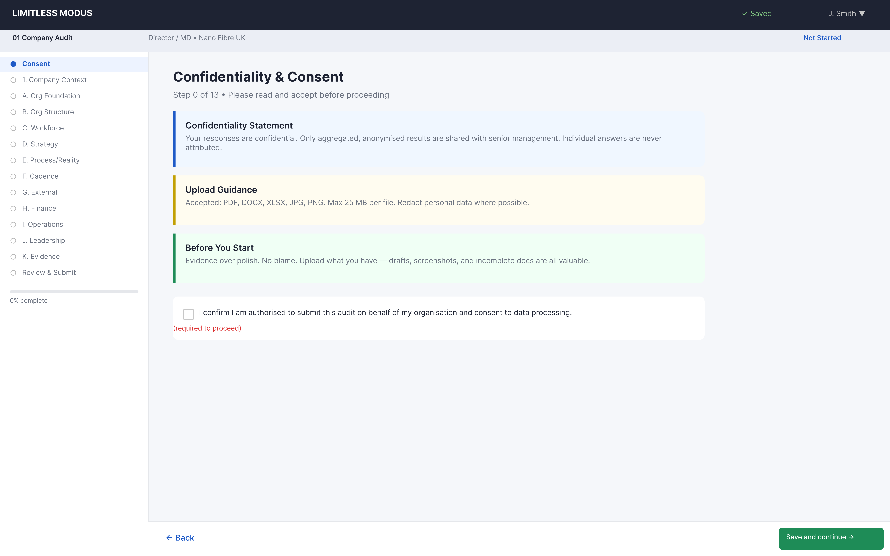
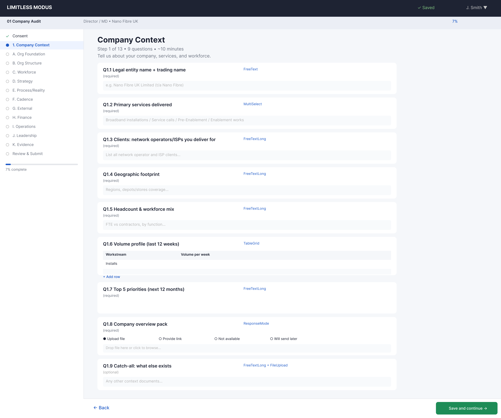
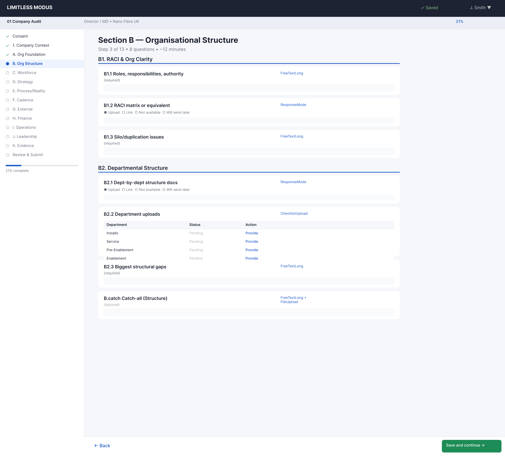
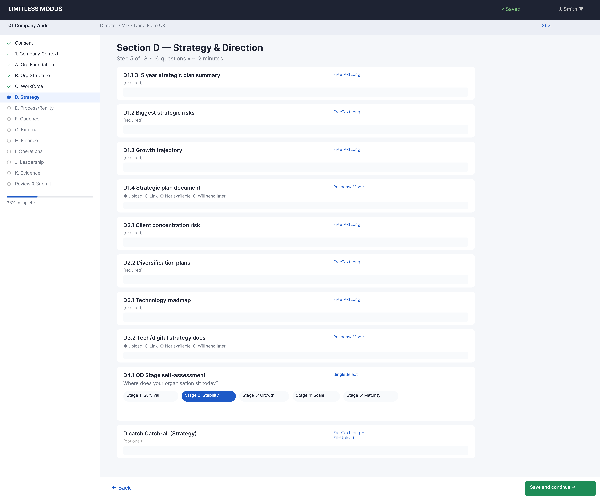
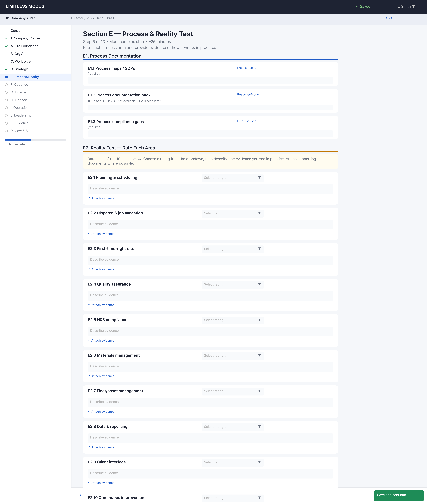
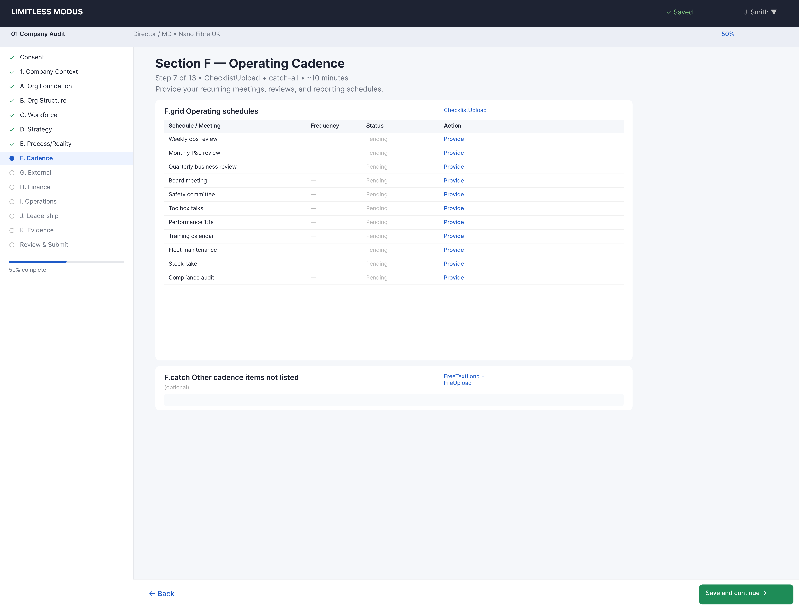
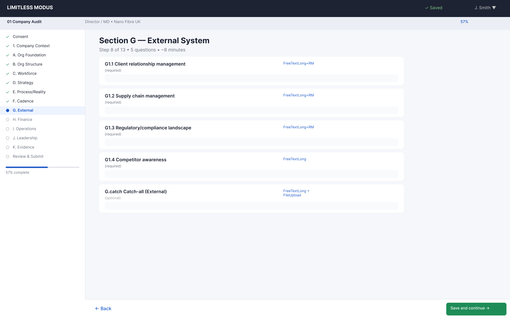
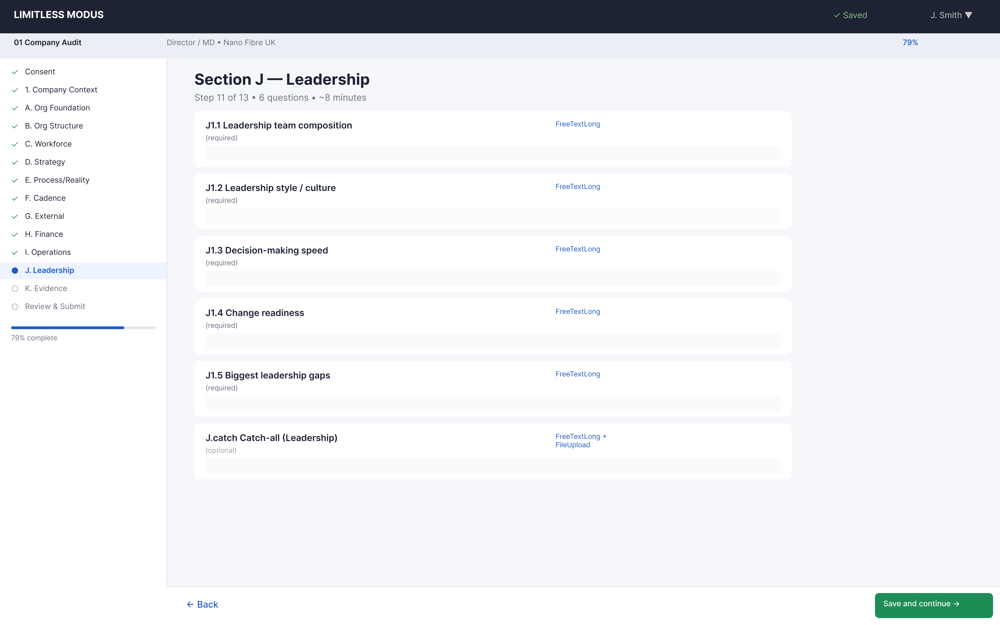
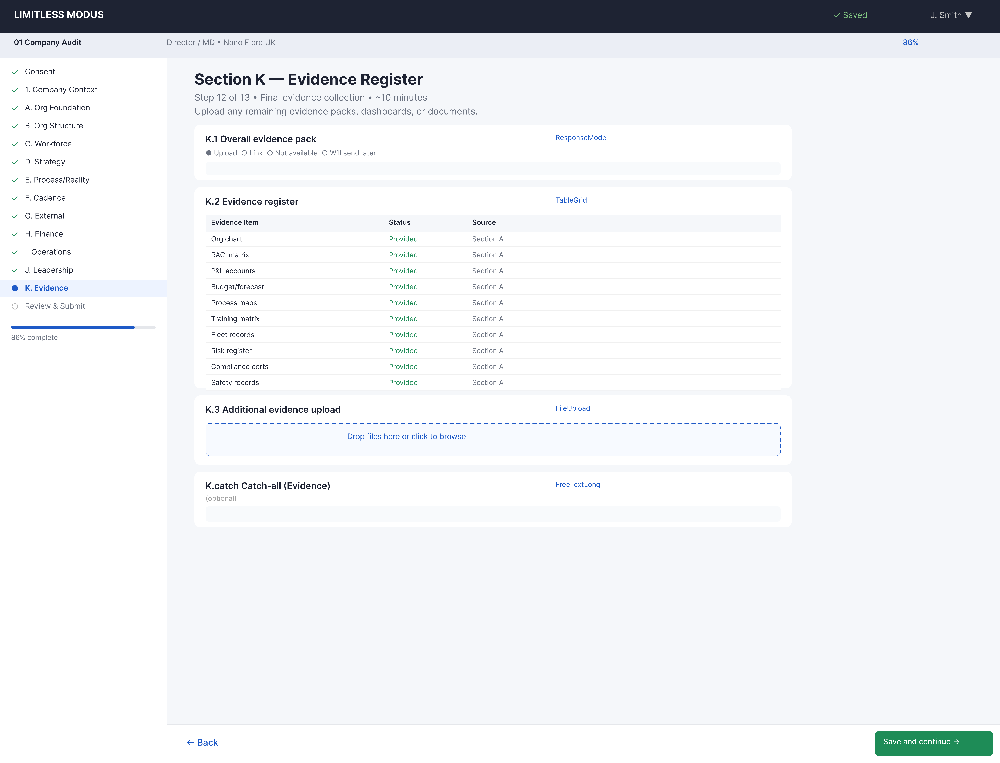
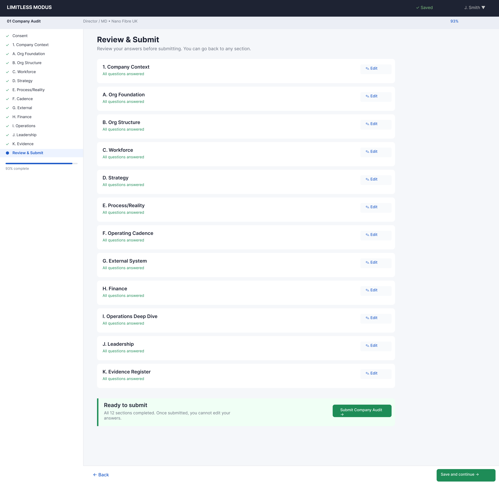

# 01 Company Audit — Wizard UI Layouts

> **Instrument:** Invincibility Blueprint — Company Audit
> **Audience:** Director / MD / CEO
> **Total steps:** 14 (Consent + Company Context + Sections A–K + Evidence + Review)
> **Estimated time:** 60–90 minutes
> **Conditional logic:** None — all sections required
> **Figma section:** "01 — Company Audit" in Wizard — Audit Self-submission page
> **Figma project:** Limitless Modus Portal

---

# Step 0 — Confidentiality & Consent

| Property | Value |
|----------|-------|
| Step number | 0 of 13 |
| Section | Consent |
| Questions | 4 (3 display + 1 interactive) |
| Question types | ConsentCheckbox |
| Gate | Cannot proceed until consent is checked |

### Question Inventory

| # | Label | Type | Required |
|---|-------|------|----------|
| 0.1 | Confidentiality statement | Display only | — |
| 0.2 | Upload guidance | Display only | — |
| 0.3 | "Before You Start" guidance | Display only | — |
| 0.4 | "I confirm I am authorised to submit this audit on behalf of my organisation and consent to data processing." | ConsentCheckbox | Yes — gate |

### Design Notes

- Three guidance cards (amber/orange left border) present key messages before any data entry.
- The consent checkbox is the only interactive element; it gates the "Save and continue" button.
- Progress sidebar shows all 13 sections with "Not Started" status.

---

# Step 1 — Company Context

| Property | Value |
|----------|-------|
| Step number | 1 of 13 |
| Section | Company Context |
| Questions | 9 |
| Question types | FreeText, MultiSelect, FreeTextLong, TableGrid, ResponseMode |
| Estimated time | ~10 minutes |

### Question Inventory

| # | Label | Type | Required |
|---|-------|------|----------|
| 1.1 | Legal entity name + trading name | FreeText | Yes |
| 1.2 | Primary services delivered (Broadband installations / Service calls / Pre-Enablement / Enablement works) | MultiSelect | Yes |
| 1.3 | Clients: network operators/ISPs you deliver for | FreeTextLong | Yes |
| 1.4 | Geographic footprint: regions, depots/stores coverage | FreeTextLong | Yes |
| 1.5 | Headcount & workforce mix (FTE vs contractors, by function) | FreeTextLong | Yes |
| 1.6 | Volume profile (last 12 weeks) — Columns: Workstream / Volume per week; Rows: Installs / Service calls / Pre-enablement / Enablement | TableGrid | Yes |
| 1.7 | Top 5 priorities (next 12 months) | FreeTextLong | Yes |
| 1.8 | Company overview pack | ResponseMode | No |
| 1.9 | Catch-all: what else exists (Context) | FreeTextLong + FileUpload | No |

### Design Notes

- First data-entry step; the sidebar highlights "Company Context" as active.
- The volume profile table (1.6) uses a TableGrid with pre-populated row headers.
- ResponseMode question (1.8) shows the 4-option pattern: Upload / Provide link / Not available / Will send later.

---

# Step 2 — A. Organisational Foundation

| Property | Value |
|----------|-------|
| Step number | 2 of 13 |
| Section | A — Organisational Foundation |
| Questions | 16 |
| Question types | FreeTextLong (10), ResponseMode (4), FreeTextLong + FileUpload (1), Display (implicit sub-groups) |
| Estimated time | ~10 minutes |

### Question Inventory

| # | Label | Type | Required |
|---|-------|------|----------|
| A1.1 | Organisation purpose statement (1 paragraph) | FreeTextLong | Yes |
| A1.2 | Core values + delivery behaviours | FreeTextLong | Yes |
| A1.3 | Non-negotiables (behaviours not tolerated) | FreeTextLong | Yes |
| A1.4 | Purpose/values documents | ResponseMode | No |
| A2.1 | Operational system description | FreeTextLong | Yes |
| A2.2 | 3–5 stability rules | FreeTextLong | Yes |
| A2.3 | Operating model/playbook | ResponseMode | No |
| A3.1 | Org chart / organogram | ResponseMode | Yes |
| A3.2 | Top-level functions list | FreeTextLong | Yes |
| A4.1 | Financial approvals thresholds | FreeTextLong | Yes |
| A4.2 | Resourcing approvals | FreeTextLong | Yes |
| A4.3 | Hiring/firing authority | FreeTextLong | Yes |
| A4.4 | Contract/commercial approvals | FreeTextLong | Yes |
| A4.5 | HSEQ stop-work authority | FreeTextLong | Yes |
| A4.6 | Escalation thresholds | FreeTextLong | Yes |
| A4.7 | DoA matrix / decision schedule | ResponseMode | Yes |
| A.catch | Catch-all (Foundation) | FreeTextLong + FileUpload | No |

### Design Notes

- Longest section in the flow (16 questions). Questions are grouped into 4 visual sub-groups (A1 Purpose/Values, A2 Operating System, A3 Structure, A4 Decision Authority).
- Sub-group headings help navigate the dense content.
- The catch-all at the bottom combines FreeTextLong with an optional FileUpload.

---

# Step 3 — B. Organisation Structure

| Property | Value |
|----------|-------|
| Step number | 3 of 13 |
| Section | B — Organisation Structure, Departments & Roles |
| Questions | 10 |
| Question types | ResponseMode (3), FreeTextLong (3), ChecklistUpload (1), TableGrid (1), Display (1), FreeTextLong + FileUpload (1) |
| Estimated time | ~8 minutes |

### Question Inventory

| # | Label | Type | Required |
|---|-------|------|----------|
| B1.1 | Latest organisation chart | ResponseMode | Yes |
| B1.2 | Departments/teams list (purpose, key outputs, interfaces) | FreeTextLong | Yes |
| B1.3 | Team charters / department summaries | ResponseMode | No |
| B2.1 | Regular Duties guidance | Display only | — |
| B2.2 | Department-by-department uploads — Items: Installs / Service / Pre-Enablement / Enablement / Dispatch / Stores / QA / HSEQ / Client Performance / Support functions / Custom. Each item: ResponseMode | ChecklistUpload | Yes |
| B3.1 | Role descriptions / job descriptions | ResponseMode | Yes |
| B3.2 | Per management layer: role purpose, top 5 outcomes, key decisions | FreeTextLong | Yes |
| B4.1 | Critical Outcomes Ownership (10 items) — Columns: Outcome / Owner / How measured / Current performance | TableGrid | Preferred |
| B.catch | Catch-all (Roles) | FreeTextLong + FileUpload | No |

### Design Notes

- The ChecklistUpload (B2.2) is a complex component: each department row has its own ResponseMode sub-field.
- TableGrid (B4.1) has 10 pre-populated outcome rows with 4 editable columns.
- Display-only guidance (B2.1) uses an amber info card.

---

# Step 4 — C. Workforce & Capability

| Property | Value |
|----------|-------|
| Step number | 4 of 13 |
| Section | C — Workforce, Capability, Performance & Discipline |
| Questions | 19 |
| Question types | FreeTextLong (14), ResponseMode (4), FreeTextLong + FileUpload (1) |
| Estimated time | ~10 minutes |

### Question Inventory

| # | Label | Type | Required |
|---|-------|------|----------|
| C1.1 | Headcount by department/function | FreeTextLong | Yes |
| C1.2 | Attrition last 12 months + top 3 reasons | FreeTextLong | Yes |
| C1.3 | Contractor reliance % | FreeTextLong | Yes |
| C1.4 | Anonymised headcount report | ResponseMode | Preferred |
| C2.1 | Mandatory competencies/accreditations | FreeTextLong | Yes |
| C2.2 | How competence is tracked/refreshed/audited | FreeTextLong | Yes |
| C2.3 | Competence matrix / training records | ResponseMode | Preferred |
| C3.1 | Performance measurement approach | FreeTextLong | Yes |
| C3.2 | Last 3 months performance reporting | ResponseMode | Yes |
| C4.1 | Open disciplinaries breakdown | FreeTextLong | Yes |
| C4.2 | Top 3 disciplinary themes | FreeTextLong | Yes |
| C4.3 | Time-to-close and where disciplinaries stall | FreeTextLong | Yes |
| C4.4 | Anonymised disciplinary summary | ResponseMode | Preferred |
| C5.1 | Succession plan for critical roles | FreeTextLong | No |
| C5.2 | Where capability breaks if you lose 2 key people | FreeTextLong | No |
| C5.3 | Succession plan upload | ResponseMode | No |
| C6.1 | Bonus/reward scheme description | FreeTextLong | No |
| C6.2 | Where incentives drive wrong behaviours | FreeTextLong | No |
| C.catch | Catch-all (People) | FreeTextLong + FileUpload | No |

### Design Notes

- 19 questions arranged in 6 sub-groups (C1 Headcount, C2 Competence, C3 Performance, C4 Discipline, C5 Succession, C6 Incentives).
- The heaviest text-entry step; most questions are FreeTextLong.
- Sub-group headers help the respondent pace themselves through the section.

---

# Step 5 — D. Strategy & Planning

| Property | Value |
|----------|-------|
| Step number | 5 of 13 |
| Section | D — Strategy, Planning & Execution Discipline |
| Questions | 13 |
| Question types | FreeTextLong (9), ResponseMode (2), SingleSelect (1), FreeTextLong + FileUpload (1) |
| Estimated time | ~8 minutes |

### Question Inventory

| # | Label | Type | Required |
|---|-------|------|----------|
| D1.1 | Current strategy description | FreeTextLong | Yes |
| D1.2 | Top 3 constraints blocking strategy | FreeTextLong | Yes |
| D1.3 | Strategy deck / business plan | ResponseMode | No |
| D2.1 | Top company goals (3–10) with success criteria, owner, status, dates | FreeTextLong | Yes |
| D2.2 | Key objectives/projects per goal | FreeTextLong | Yes |
| D2.3 | Top 3 active objectives task plan | FreeTextLong | Yes |
| D2.4 | Top 10 overdue tasks/actions and why | FreeTextLong | Yes |
| D2.5 | Where plans typically fail | FreeTextLong | Yes |
| D2.6 | Goals/project/task trackers | ResponseMode | Preferred |
| D3.1 | OD Stage self-assessment — Options: Stage 1 (Start-up) / Stage 2 (Regular Management) / Stage 3 (Viral Expansion) / Stage 4 (Synergistic Brotherhood) | SingleSelect | Yes |
| D3.2 | Evidence for selected stage (3–5 examples) | FreeTextLong | Yes |
| D3.3 | Target stage in 12–24 months and why | FreeTextLong | Yes |
| D.catch | Catch-all (Strategy/Plans) | FreeTextLong + FileUpload | No |

### Design Notes

- The OD Stage self-assessment (D3.1) is a SingleSelect with 4 maturity options — this is a key diagnostic question.
- Three sub-groups: D1 Strategy, D2 Goals/Execution, D3 OD Stage Assessment.
- D2 sub-group is the densest with 6 sequential FreeTextLong questions about goal tracking.

---

# Step 6 — E. Process & Reality Tests

| Property | Value |
|----------|-------|
| Step number | 6 of 13 |
| Section | E — Process, Compliance & Reality Tests |
| Questions | 12 |
| Question types | FreeTextLong + ResponseMode (4), FreeTextLong (3), RatingScaleWithEvidence (2), ResponseMode (2), FreeTextLong + FileUpload (1) |
| Estimated time | ~12 minutes |

### Question Inventory

| # | Label | Type | Required |
|---|-------|------|----------|
| E1.1 | Process map: Installs | FreeTextLong + ResponseMode | Yes |
| E1.2 | Process map: Service | FreeTextLong + ResponseMode | Yes |
| E1.3 | Process map: Pre-Enablement | FreeTextLong + ResponseMode | Yes |
| E1.4 | Process map: Enablement | FreeTextLong + ResponseMode | Yes |
| E1.5 | Top 10 break points | FreeTextLong | Yes |
| E1.6 | Process maps / SOP index / work instructions | ResponseMode | Yes |
| E2.1 | Reality Test: 10 standard components — 8-point rating scale per item + evidence description + optional file | RatingScaleWithEvidence | Yes |
| E2.2 | Additional components (up to 8) | RatingScaleWithEvidence | Yes |
| E3.1 | Contract register summary | ResponseMode | Yes |
| E3.2 | KPI/SLA schedules and scorecards | ResponseMode | Yes |
| E3.3 | Commercial governance description | FreeTextLong | Yes |
| E3.4 | Contract extracts (redacted) | ResponseMode | No |
| E.catch | Catch-all (Process/Compliance) | FreeTextLong + FileUpload | No |

### Design Notes

- The Reality Test (E2.1) is the most complex question type in the entire wizard: each of 10 standard items gets an 8-point rating dropdown plus a free-text evidence description and optional file upload.
- Rating options: Exists and is used / Exists but not used consistently / Claimed to exist but cannot be found / Exists but under-resourced / Implemented but no effect / Tool used for wrong purpose / Multiple approaches conflict / Works only because specific people carry it.
- Process map questions (E1.1–E1.4) are compound: FreeTextLong for the description + ResponseMode for document upload.
- Three sub-groups: E1 Process Maps, E2 Reality Test, E3 Commercial Compliance.

---

# Step 7 — F. Operating Cadence

| Property | Value |
|----------|-------|
| Step number | 7 of 13 |
| Section | F — Operating Cadence & Control Schedules |
| Questions | 2 |
| Question types | ChecklistUpload (1), FreeTextLong + FileUpload (1) |
| Estimated time | ~5 minutes |

### Question Inventory

| # | Label | Type | Required |
|---|-------|------|----------|
| F.grid | 11 schedules (F1–F11), each with ResponseMode sub-field — F1: Reporting & communications / F2: Decision-making / F3: KPI / F4: SLA / F5: Absence cover / F6: Escalation / F7: Out-of-hours / F8: Systems / F9: Reports / F10: Documentation / F11: Customer feedback | ChecklistUpload | Yes |
| F.catch | Catch-all (Cadence/Schedules) | FreeTextLong + FileUpload | No |

### Design Notes

- The ChecklistUpload (F.grid) lists 11 named schedules, each with a ResponseMode sub-field (Upload / Link / None + explain).
- This is a compact step with high upload density.
- The layout uses the checklist pattern with expandable upload rows.

---

# Step 8 — G. External System

| Property | Value |
|----------|-------|
| Step number | 8 of 13 |
| Section | G — External System |
| Questions | 5 |
| Question types | FreeTextLong + ResponseMode (3), FreeTextLong (1), FreeTextLong + FileUpload (1) |
| Estimated time | ~5 minutes |

### Question Inventory

| # | Label | Type | Required |
|---|-------|------|----------|
| G.1 | Supplier/subcontractor register | FreeTextLong + ResponseMode | Yes |
| G.2 | Client register | FreeTextLong + ResponseMode | Yes |
| G.3 | Service catalogue | FreeTextLong + ResponseMode | Yes |
| G.4 | Top 5 market/industry forces | FreeTextLong | Yes |
| G.catch | Catch-all (External) | FreeTextLong + FileUpload | No |

### Design Notes

- A shorter step with 3 compound questions (description + upload) and one pure text question.
- Good pace-break after the dense process/reality test section.

---

# Step 9 — H. Finance & Full Cost Audit

| Property | Value |
|----------|-------|
| Step number | 9 of 13 |
| Section | H — Finance & Full Cost Audit |
| Questions | 28 |
| Question types | FreeTextLong (18), ResponseMode (6), ChecklistUpload (2), FreeTextLong + ResponseMode (1), FreeTextLong + FileUpload (1) |
| Estimated time | ~15 minutes |

### Question Inventory

| # | Label | Type | Required |
|---|-------|------|----------|
| H1.1 | Last 12 months monthly actuals P&L | ResponseMode | Yes |
| H1.2 | Last FY P&L + current forecast | ResponseMode | Yes |
| H1.3 | Chart of accounts | ResponseMode | No |
| H2.1 | Fleet costs | FreeTextLong | Yes |
| H2.2 | Tools/test equipment | FreeTextLong | Yes |
| H2.3 | Subcontractor costs | FreeTextLong | Yes |
| H2.4 | Overtime/standby/on-call | FreeTextLong | Yes |
| H2.5 | Rework cost indicators | FreeTextLong | Yes |
| H2.6 | Cost driver uploads | ResponseMode | No |
| H3.1 | Estates list (purpose, utilisation, cost, lease terms) | FreeTextLong | Yes |
| H3.2 | Leases / facilities cost schedule | ResponseMode | No |
| H4.1 | Where costs are leaking | FreeTextLong | Yes |
| H4.2 | What costs feel normal but are waste | FreeTextLong | Yes |
| H4.3 | Where penalties/credits/chargebacks occur | FreeTextLong | Yes |
| H.catch.1 | Catch-all (Finance/Costs) | FreeTextLong + FileUpload | No |
| H5.1 | Inventory value split (warehouse/depots/van/in-transit) | FreeTextLong | Yes |
| H5.2 | Inventory ageing by value | FreeTextLong | Yes |
| H5.3 | Slow-moving/obsolete % and write-off policy | FreeTextLong | Yes |
| H5.4 | Stock turns / Days on Hand | FreeTextLong | Yes |
| H5.5 | Stock accuracy (cycle counts vs book) | FreeTextLong | Yes |
| H5.6 | Stuck returns value and management | FreeTextLong | Yes |
| H5.7 | Client-owned/consignment stock rules | FreeTextLong | Yes |
| H5.uploads | Inventory uploads (7 items) | ChecklistUpload | Preferred |
| H6.1 | Unit-rate schedules / rate cards | ResponseMode | Yes |
| H6.2 | "Done for payment" description per client | FreeTextLong | Yes |
| H6.3 | Throughput pipeline (last 3 months) | FreeTextLong + ResponseMode | Yes |
| H6.4 | WIP/unbilled backlog | FreeTextLong | Yes |
| H6.5 | Top 10 rejected closure reasons | FreeTextLong | Yes |
| H6.6 | Top 10 invoice dispute reasons | FreeTextLong | Yes |
| H6.7 | Credits/penalties/chargebacks summary | FreeTextLong | Yes |
| H6.uploads | Throughput uploads (5 items) | ChecklistUpload | Preferred |

### Design Notes

- The longest step by question count (28 questions across 6 sub-groups).
- Sub-groups: H1 P&L, H2 Cost Drivers, H3 Estates, H4 Cost Leakage, H5 Inventory, H6 Throughput/Revenue.
- Two ChecklistUpload blocks (H5.uploads, H6.uploads) for batch document uploads.
- This step benefits most from the section-at-a-time principle — respondents can tackle sub-groups in sittings.

---

# Step 10 — I. Operations Deep Dive

| Property | Value |
|----------|-------|
| Step number | 10 of 13 |
| Section | I — Operations Deep Dive |
| Questions | 40 |
| Question types | FreeTextLong (29), ResponseMode (5), TableGrid (1), SingleSelect (1), ChecklistUpload (1), FreeTextLong + FileUpload (1) |
| Estimated time | ~15 minutes |

### Question Inventory

| # | Label | Type | Required |
|---|-------|------|----------|
| I1.1 | Install flow description | FreeTextLong | Yes |
| I1.2 | Top 10 install failure reasons | FreeTextLong | Yes |
| I1.3 | Right First Time % and measurement | FreeTextLong | Yes |
| I1.4 | Early Life Failure % and measurement | FreeTextLong | Yes |
| I1.5 | Appointment promise control | FreeTextLong | Yes |
| I1.6 | Where installs get blocked | FreeTextLong | Yes |
| I1.7 | Install uploads | ResponseMode | No |
| I2.1 | Service flow description | FreeTextLong | Yes |
| I2.2 | SLA targets vs actual | FreeTextLong | Yes |
| I2.3 | Repeat fault rate and causes | FreeTextLong | Yes |
| I2.4 | Root cause process | FreeTextLong | Yes |
| I2.5 | Service uploads | ResponseMode | No |
| I3.1 | Pre-enablement flow description | FreeTextLong | Yes |
| I3.2 | Common outcomes | FreeTextLong | Yes |
| I3.3 | Success measurement | FreeTextLong | Yes |
| I3.4 | Where pre-enablement creates waste | FreeTextLong | Yes |
| I3.5 | Pre-enablement uploads | ResponseMode | No |
| I4.1 | Enablement workflow description | FreeTextLong | Yes |
| I4.2 | % installs/service blocked by enablement | FreeTextLong | Yes |
| I4.3 | Common enablement types | FreeTextLong | Yes |
| I4.4 | Where delays occur | FreeTextLong | Yes |
| I4.5 | Enablement uploads | ResponseMode | No |
| I5.1 | Dispatch rules | FreeTextLong | Yes |
| I5.2 | Non-productive time breakdown — Columns: Category / Estimate; Rows: Van-travel / Stores collection / Waiting access / Waiting records / Waiting permits / Rework / Admin / Portal admin / FSM mismatch / Other | TableGrid | Yes |
| I5.3 | Top 5 causes of lost time per week | FreeTextLong | Yes |
| I5.4 | Dispatch uploads | ResponseMode | No |
| I6.1 | Materials flow description | FreeTextLong | Yes |
| I6.2 | Where losses/waste occur | FreeTextLong | Yes |
| I6.3 | Stockout frequency and impact | FreeTextLong | Yes |
| I6.4 | Top 20 SKUs by value | FreeTextLong | No |
| I6.5 | "Just in case" stock | FreeTextLong | Yes |
| I6.6 | Unusable stock value | FreeTextLong | No |
| I6.7 | Stores uploads | ResponseMode | No |
| I6B.1 | Hold free-issue stock? | SingleSelect (Yes/No) | Yes |
| I6B.2–7 | Free-issue details (6 questions, conditional on Yes) | FreeTextLong | Conditional |
| I6B.uploads | Free-issue uploads (5 items) | ChecklistUpload | No |
| I7.1 | QA gates description | FreeTextLong | Yes |
| I7.2 | How findings become corrective action | FreeTextLong | Yes |
| I7.3 | QA uploads | ResponseMode | No |
| I8.1 | Safety standards: embedded, audited, enforced | FreeTextLong | Yes |
| I8.2 | Last 6–12 months safety summary | FreeTextLong | Yes |
| I8.3 | HSEQ uploads | ResponseMode | No |
| I.catch | Catch-all (Operations) | FreeTextLong + FileUpload | No |

### Design Notes

- The deepest step by question count (~40 questions across 8 operational sub-groups).
- Sub-groups: I1 Installs, I2 Service, I3 Pre-Enablement, I4 Enablement, I5 Dispatch, I6 Materials, I7 QA, I8 HSEQ.
- Conditional logic within I6B: free-issue questions only appear if I6B.1 = Yes.
- The Non-Productive Time TableGrid (I5.2) reuses the same 10-row category structure that appears in the Manager and Engineer audits.
- This section is visually dense; sub-group headings and question numbering are essential for navigation.

---

# Step 11 — J. Leadership System Signals

| Property | Value |
|----------|-------|
| Step number | 11 of 13 |
| Section | J — Leadership System Signals |
| Questions | 6 |
| Question types | FreeTextLong (5), FreeTextLong + FileUpload (1) |
| Estimated time | ~5 minutes |

### Question Inventory

| # | Label | Type | Required |
|---|-------|------|----------|
| J.1 | % leadership time firefighting vs prevention | FreeTextLong | Yes |
| J.2 | Last 5 repeat problems that keep returning | FreeTextLong | Yes |
| J.3 | Where important information arrives late | FreeTextLong | Yes |
| J.4 | Where senior leaders bypass managers | FreeTextLong | Yes |
| J.5 | Where trust in management system is low | FreeTextLong | Yes |
| J.catch | Catch-all (Leadership) | FreeTextLong + FileUpload | No |

### Design Notes

- A deliberately short, reflective step after the operations deep dive.
- All questions are FreeTextLong — pure narrative capture.
- This is a "signal detection" section: the answers here often reveal systemic issues that surface across other sections.

---

# Step 12 — K. Evidence Register

| Property | Value |
|----------|-------|
| Step number | 12 of 13 |
| Section | K — Evidence Register |
| Questions | 3 |
| Question types | ResponseMode (1), TableGrid (1), FileUpload (1) |
| Estimated time | ~5 minutes |

### Question Inventory

| # | Label | Type | Required |
|---|-------|------|----------|
| K.1 | Document register / index | ResponseMode | No |
| K.2 | Document list (if no register) — Columns: Name / Owner / Location-link / Last updated / What it proves | TableGrid | No |
| K.3 | Evidence pack upload | FileUpload | No |

### Design Notes

- All questions are optional — this is a "bonus" capture step.
- The TableGrid (K.2) allows respondents to manually list documents if they don't have a formal register.
- FileUpload (K.3) accepts a bulk evidence pack.
- This step often captures documents that were referenced but not uploaded in earlier sections.

---

# Step 13 — Review & Submit

| Property | Value |
|----------|-------|
| Step number | 13 of 13 |
| Section | Review & Submit |
| Questions | 0 (summary view) |
| Question types | — |

### Design Notes

- No new questions — this is a read-only summary of all completed sections.
- Each section shows a completion badge (complete / in progress / not started).
- The "Submit Audit" button replaces the standard "Save and continue" button.
- Respondents can click any section to return and edit before final submission.
- The progress bar shows 100% (or actual completion state).
- After submission, the wizard transitions to a confirmation view and locks further edits.

---

## Appendix — Question Type Inventory

| Type | Count | Steps Used In |
|------|-------|---------------|
| FreeTextLong | ~90 | Steps 1–11 |
| ResponseMode | ~25 | Steps 1–10, 12 |
| FreeTextLong + FileUpload | ~12 | Steps 1–11 (catch-all per section) |
| FreeTextLong + ResponseMode | ~7 | Steps 6, 8 |
| ChecklistUpload | 5 | Steps 3, 7, 9, 10 |
| TableGrid | 4 | Steps 1, 3, 9, 10, 12 |
| RatingScaleWithEvidence | 2 | Step 6 |
| SingleSelect | 2 | Steps 5, 10 |
| MultiSelect | 1 | Step 1 |
| ConsentCheckbox | 1 | Step 0 |
| FileUpload | 1 | Step 12 |
| Display only | ~5 | Steps 0, 3 |

## Appendix — Figma Node Reference

| Step | Frame Name | Node ID |
|------|-----------|---------|
| 0 | 01-Step0 Consent | `2009:204` |
| 1 | 01-Step1 Company Context | `2009:270` |
| 2 | 01-Step2 A — Org Foundation | `2009:381` |
| 3 | 01-Step3 B — Org Structure | `2009:525` |
| 4 | 01-Step4 C — Workforce | `2009:632` |
| 5 | 01-Step5 D — Strategy | `2009:776` |
| 6 | 01-Step6 E — Process/Reality | `2009:885` |
| 7 | 01-Step7 F — Cadence | `2009:1037` |
| 8 | 01-Step8 G — External | `2009:1167` |
| 9 | 01-Step9 H — Finance | `2009:1242` |
| 10 | 01-Step10 I — Operations | `2009:1445` |
| 11 | 01-Step11 J — Leadership | `2010:1759` |
| 12 | 01-Step12 K — Evidence | `2010:1839` |
| 13 | 01-Review Review & Submit | `2010:1962` |

## Related Files

- **Specification:** [wizard-specification.md](wizard-specification.md)
- **Figma layouts overview:** [wizard-figma-layouts.md](wizard-figma-layouts.md)
- **Figma project:** Limitless Modus Portal → Wizard — Audit Self-submission → 01 Company Audit section
