# 02 Manager Audit — Wizard UI Layouts

> **Instrument:** Invincibility Blueprint — Manager Audit
> **Audience:** Functional managers (all departments)
> **Total steps:** 15 (Consent + Sections 1–13 + Review)
> **Estimated time:** 30–45 minutes
> **Conditional logic:** Section 5 branches by department (selected in Section 1)
> **Figma section:** "02 — Manager Audit" in Wizard — Audit Self-submission page
> **Figma project:** Limitless Modus Portal

---

# Step 0 — Confidentiality & Consent

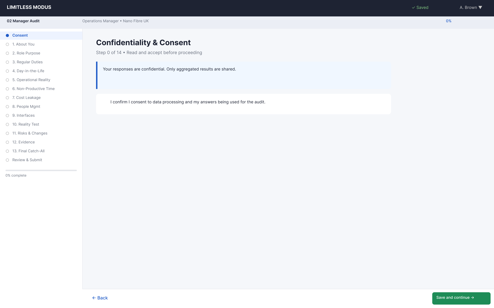

| Property | Value |
|----------|-------|
| Step number | 0 of 14 |
| Section | Consent |
| Questions | 2 (1 display + 1 interactive) |
| Question types | ConsentCheckbox |
| Gate | Cannot proceed until consent is checked |

### Question Inventory

| # | Label | Type | Required |
|---|-------|------|----------|
| 0.1 | Confidentiality statement + upload guidance + "How to Use" | Display only | — |
| 0.2 | Consent checkbox | ConsentCheckbox | Yes — gate |

### Design Notes

- Combined guidance and consent on a single screen.
- Progress sidebar shows all sections; "Consent" is highlighted.

---

# Step 1 — Section 1: About You

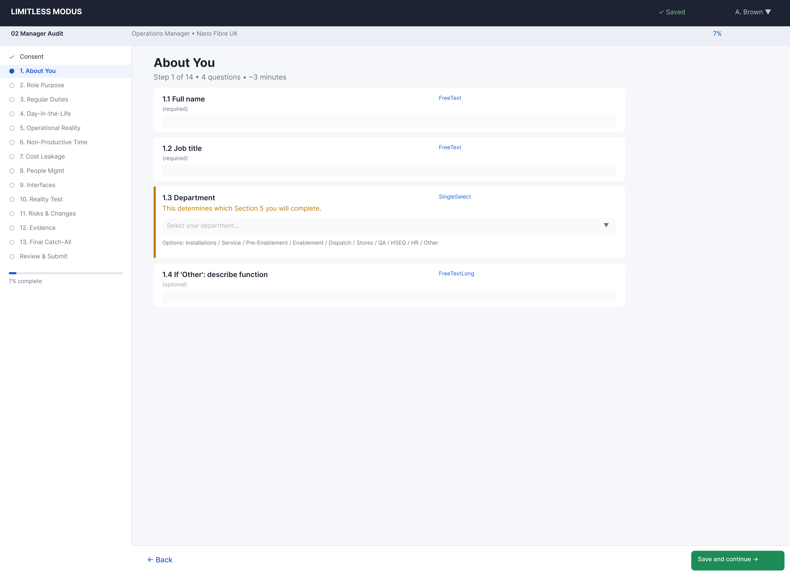

| Property | Value |
|----------|-------|
| Step number | 1 of 14 |
| Section | 1 — About You |
| Questions | 8 |
| Question types | FreeText (5), SingleSelect (2), FreeText conditional (1) |
| Routing trigger | Question 1.3 determines Section 5 variant |

### Question Inventory

| # | Label | Type | Required |
|---|-------|------|----------|
| 1.1 | Name | FreeText | Yes |
| 1.2 | Role title | FreeText | Yes |
| 1.3 | Department/team — Options: Field Ops – Installations / Field Ops – Service Calls/Repair / Field Ops – Pre-Enablement / Field Ops – Enablement Works / Dispatch/Scheduling / Stores/Materials / QA/Quality / HSEQ / HR / Other | SingleSelect | Yes |
| 1.4 | Other department (describe) | FreeText | Conditional (1.3 = Other) |
| 1.5 | Location/region covered | FreeText | Yes |
| 1.6 | Who do you report to? | FreeText | Yes |
| 1.7 | Team size (direct + indirect) | FreeText | Yes |
| 1.8 | Workforce mix — Options: Employed only / Subcontractors only / Both | SingleSelect | No |

### Design Notes

- The department dropdown (1.3) is the routing trigger for Section 5. The selected value determines which operational reality sub-section the participant sees.
- Question 1.4 only appears when "Other" is selected in 1.3.
- This step collects profile data used for routing and segmentation in the analysis.

---

# Step 2 — Section 2: Role Purpose

| Property | Value |
|----------|-------|
| Step number | 2 of 14 |
| Section | 2 — Role Purpose & What "Good" Looks Like |
| Questions | 5 |
| Question types | FreeTextLong (4), ResponseMode (1) |

### Question Inventory

| # | Label | Type | Required |
|---|-------|------|----------|
| 2.1 | Purpose of your role (1 paragraph) | FreeTextLong | Yes |
| 2.2 | Top 5 outcomes you are accountable for | FreeTextLong | Yes |
| 2.3 | What "good" looks like (targets/standards/behaviours) | FreeTextLong | Yes |
| 2.4 | Decisions without escalation (examples) | FreeTextLong | Yes |
| 2.5 | Role profile / objectives / scorecard | ResponseMode | No |

### Design Notes

- Pure narrative capture step with one optional document upload.
- Questions progress from role definition to accountability to autonomy — a deliberate diagnostic structure.

---

# Step 3 — Section 3: Regular Duties & Cadence

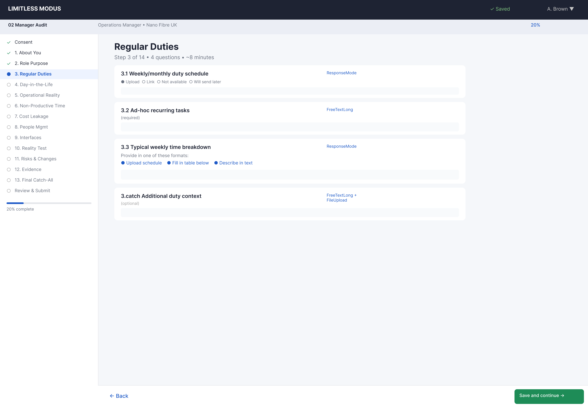

| Property | Value |
|----------|-------|
| Step number | 3 of 14 |
| Section | 3 — Regular Duties & Cadence |
| Questions | 3 |
| Question types | ResponseMode (1), TableGrid (1), FreeTextLong (1) |
| Fallback logic | Participants use whichever method suits them best |

### Question Inventory

| # | Label | Type | Required |
|---|-------|------|----------|
| 3.1 | Regular Duties & Cadence list upload | ResponseMode | Yes |
| 3.2 | Quick-create duties table — Columns: Activity / Purpose / Method / Output / Trigger / Frequency / Duration / Target day / R-A | TableGrid | Fallback |
| 3.3 | Fast fallback: top 10 recurring duties | FreeTextLong | Fallback |

### Design Notes

- Three-tier capture: upload a pre-existing list (3.1), or build one in the table (3.2), or describe duties in prose (3.3).
- The TableGrid (3.2) has 9 columns — wider than most tables in the wizard. May need horizontal scroll on smaller screens.
- This is a key diagnostic input: the Regular Duties cadence reveals how structured the manager's role actually is.

---

# Step 4 — Section 4: Day-in-the-Life

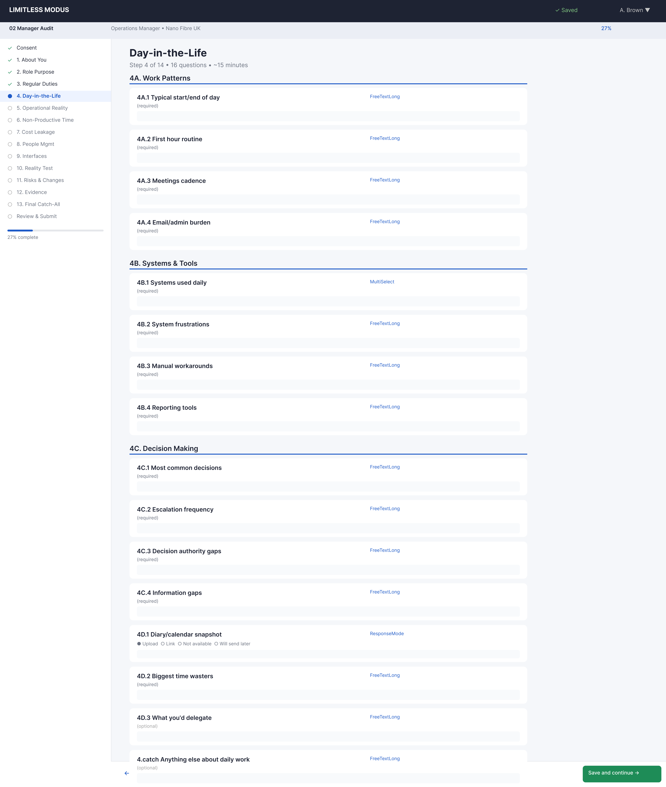

| Property | Value |
|----------|-------|
| Step number | 4 of 14 |
| Section | 4 — Day-in-the-Life & Time Sinks |
| Questions | 17 |
| Question types | FreeTextLong (10), MultiSelect (2), FreeText (1), ResponseMode (1), FreeTextLong + conditional (3) |
| Sub-groups | 4 main, 4B Systems, 4C Throughput |

### Question Inventory

| # | Label | Type | Required |
|---|-------|------|----------|
| 4.1 | Typical day/week (short narrative) | FreeTextLong | Yes |
| 4.2 | Top 5 recurring interruptions | FreeTextLong | Yes |
| 4.3 | Non-value-adding time | FreeTextLong | Yes |
| 4B.1 | Systems used — Options: Internal FSM / Client portals / QA tools / Stock system / Mapping-GIS / Time capture / Other | MultiSelect | Yes |
| 4B.2 | Client portal names (if selected) | FreeText | Conditional |
| 4B.3 | Where information entered more than once | FreeTextLong | Yes |
| 4B.4 | Where status mismatches occur | FreeTextLong | Yes |
| 4B.5 | Portal rules that block closure | FreeTextLong | Yes |
| 4B.6 | Where you lose most time — Options: Logging in / Slow portals / Searching job details / Re-keying / Evidence upload / Error correction / Conflicting instructions | MultiSelect | Yes |
| 4B.7 | Workaround when systems fail | FreeTextLong | Yes |
| 4B.8 | Portal guides/screenshots | ResponseMode | No |
| 4C.1 | What counts as "done" vs "paid" | FreeTextLong | Yes |
| 4C.2 | Where work gets stuck after physically done | FreeTextLong | Yes |
| 4C.3 | Backlog tracked? Approximate volume and ageing | FreeTextLong | Yes |
| 4C.4 | Top 5 reasons jobs remain stuck beyond 48 hours | FreeTextLong | Yes |
| 4C.5 | Single lever to increase jobs accepted/paid per day | FreeTextLong | Yes |
| 4C.6 | Throughput uploads | ResponseMode | No |

### Design Notes

- This step is structurally the densest in the Manager Audit (17 questions across 3 sub-groups).
- Sub-groups: 4 (Day-in-the-Life), 4B (Systems & Portals), 4C (Throughput/Stuck Work).
- The "done vs paid" distinction (4C) is a critical diagnostic concept — it surfaces the gap between operational completion and commercial closure.

---

# Step 5 — Section 5: Operational Reality (Conditional)

Section 5 routes by the department selected in Step 1 (question 1.3). There are 9 possible variants. Three unique Figma layouts cover all variants:

1. **Representative layout** — covers 5.1 (Installations), 5.2 (Service), 5.3 (Pre-Enablement), 5.4 (Enablement), 5.7 (QA), 5.8 (HSEQ), 5.9 (HR)
2. **Dispatch layout** — covers 5.5 (Dispatch/Scheduling)
3. **Stores layout** — covers 5.6 (Stores/Materials) + 5.6B (Inventory Value) + 5.6C (Free-Issue)

## Step 5 — Variant 5.1: Field Ops — Installations

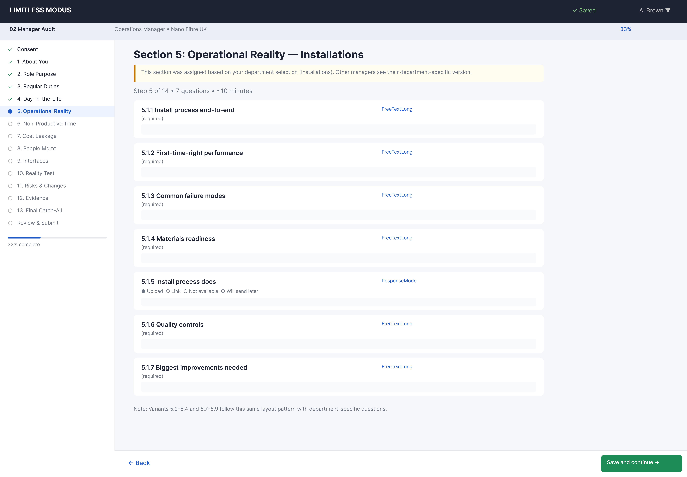

| Property | Value |
|----------|-------|
| Section | 5.1 — Field Ops — Installations |
| Questions | 7 |
| Question types | FreeTextLong (6), ResponseMode (1) |
| Condition | Department = Field Ops – Installations |

### Question Inventory

| # | Label | Type | Required |
|---|-------|------|----------|
| 5.1.1 | Top 10 install failure reasons | FreeTextLong | Yes |
| 5.1.2 | Right First Time performance view | FreeTextLong | Yes |
| 5.1.3 | Early Life Failure view | FreeTextLong | Yes |
| 5.1.4 | Where installs get blocked | FreeTextLong | Yes |
| 5.1.5 | Where rework is created | FreeTextLong | Yes |
| 5.1.6 | Throughput check: done-but-not-paid in installs | FreeTextLong | Yes |
| 5.1.7 | Install uploads | ResponseMode | No |

> **Figma note:** This uses the representative Figma frame. The layout structure is identical for variants 5.1–5.4, 5.7–5.9 — only question labels and counts differ.

## Step 5 — Variant 5.2: Field Ops — Service Calls

*Uses the same representative Figma layout as 5.1.*

| # | Label | Type | Required |
|---|-------|------|----------|
| 5.2.1 | Top 10 fault types | FreeTextLong | Yes |
| 5.2.2 | Top 5 repeat fault causes | FreeTextLong | Yes |
| 5.2.3 | Where fault-to-fix stalls | FreeTextLong | Yes |
| 5.2.4 | Evidence needed to prove resolution | FreeTextLong | Yes |
| 5.2.5 | Throughput check: done-but-not-paid in service | FreeTextLong | Yes |
| 5.2.6 | Service uploads | ResponseMode | No |

## Step 5 — Variant 5.3: Field Ops — Pre-Enablement

*Uses the same representative Figma layout as 5.1.*

| # | Label | Type | Required |
|---|-------|------|----------|
| 5.3.1 | What triggers pre-enablement, common outcomes | FreeTextLong | Yes |
| 5.3.2 | Biggest "not ready" cause | FreeTextLong | Yes |
| 5.3.3 | Where it reduces/creates waste | FreeTextLong | Yes |
| 5.3.4 | Evidence/info for install handover | FreeTextLong | Yes |
| 5.3.5 | Throughput check: done-but-not-paid | FreeTextLong | Yes |
| 5.3.6 | Pre-enablement uploads | ResponseMode | No |

## Step 5 — Variant 5.4: Field Ops — Enablement Works

*Uses the same representative Figma layout as 5.1.*

| # | Label | Type | Required |
|---|-------|------|----------|
| 5.4.1 | Top 10 enablement work types | FreeTextLong | Yes |
| 5.4.2 | Where delays occur most | FreeTextLong | Yes |
| 5.4.3 | % reactive firefighting vs planned | FreeTextLong | Yes |
| 5.4.4 | Biggest rework drivers | FreeTextLong | Yes |
| 5.4.5 | Throughput check: done-but-not-paid | FreeTextLong | Yes |
| 5.4.6 | Enablement uploads | ResponseMode | No |

## Step 5 — Variant 5.5: Dispatch / Scheduling

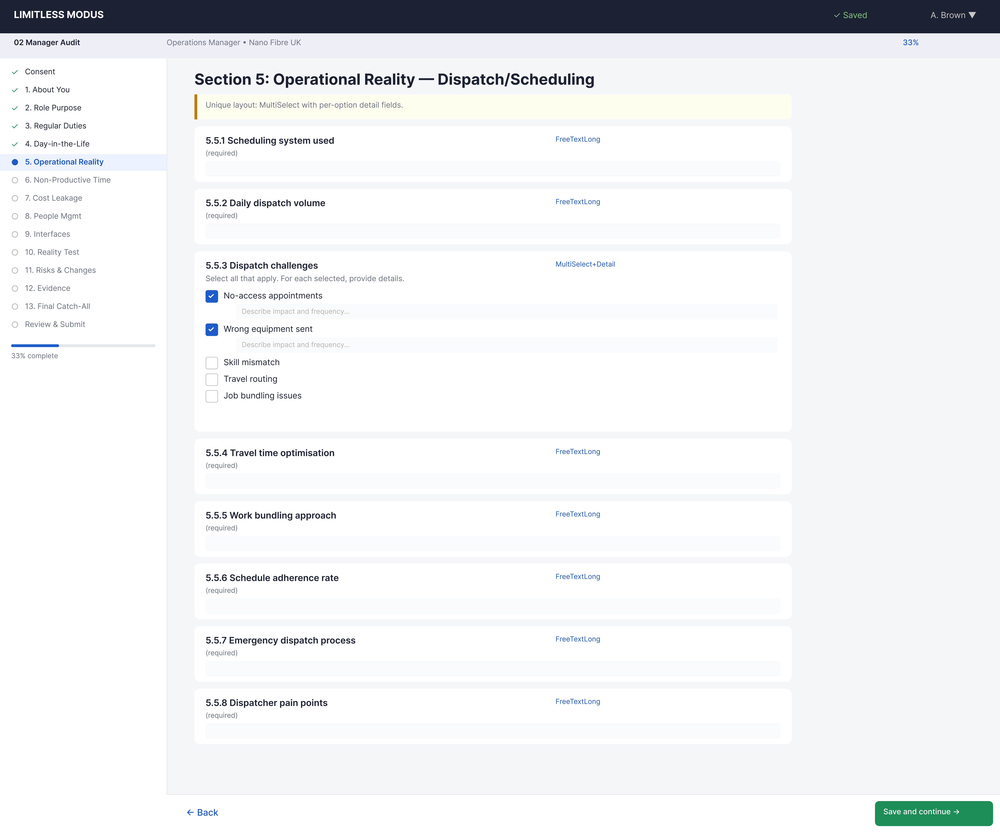

| Property | Value |
|----------|-------|
| Section | 5.5 — Dispatch / Scheduling |
| Questions | 8 |
| Question types | FreeTextLong (4), MultiSelect + FreeTextLong per item (2), ResponseMode (1) |
| Condition | Department = Dispatch/Scheduling |

### Question Inventory

| # | Label | Type | Required |
|---|-------|------|----------|
| 5.5.1 | Scheduling approach | FreeTextLong | Yes |
| 5.5.2 | Top 5 causes of schedule instability — Options: Cancellations / Overruns / Priority-SLA escalations / Skills mismatch / Portal-driven changes / FSM-portal sync delays (each with FreeTextLong) | MultiSelect + FreeTextLong per item | Yes |
| 5.5.3 | Job allocation rules and portal overrides | FreeTextLong | Yes |
| 5.5.4 | Where dispatch loses most time — Options: Missing job data / Portal admin / Re-keying / Chasing updates / Evidence requirements / Preventing disputes (each with FreeTextLong) | MultiSelect + FreeTextLong per item | Yes |
| 5.5.5 | Most common reason jobs fail to close | FreeTextLong | Yes |
| 5.5.6 | One system improvement wished for | FreeTextLong | Yes |
| 5.5.7 | Throughput check: done-but-not-paid backlog | FreeTextLong | Yes |
| 5.5.8 | Dispatch uploads | ResponseMode | No |

### Design Notes

- Unique layout: compound MultiSelect + FreeTextLong questions (5.5.2, 5.5.4) expand a text area per selected option.
- This is a distinct Figma frame because the compound question pattern differs from the representative layout.

## Step 5 — Variant 5.6: Stores / Materials

| Property | Value |
|----------|-------|
| Section | 5.6 — Stores / Materials (+ 5.6B + 5.6C) |
| Questions | 22 |
| Question types | FreeTextLong (17), ResponseMode (3), SingleSelect (1) |
| Condition | Department = Stores/Materials |

### Question Inventory — 5.6 Materials Flow

| # | Label | Type | Required |
|---|-------|------|----------|
| 5.6.1 | Materials flow description | FreeTextLong | Yes |
| 5.6.2 | Where losses/waste occur | FreeTextLong | Yes |
| 5.6.3 | How often stockouts block jobs | FreeTextLong | Yes |
| 5.6.4 | Root cause of "right kit not on van" | FreeTextLong | Yes |
| 5.6.5 | Stores uploads | ResponseMode | No |

### Question Inventory — 5.6B Inventory Value

| # | Label | Type | Required |
|---|-------|------|----------|
| 5.6B.1 | Largest bucket of cash tied up in stock | FreeTextLong | Yes |
| 5.6B.2 | Overstocked items and why | FreeTextLong | Yes |
| 5.6B.3 | Understocked items and impact | FreeTextLong | Yes |
| 5.6B.4 | Stock ageing/slow movers visibility | FreeTextLong | Yes |
| 5.6B.5 | Returns loop: where it stalls | FreeTextLong | Yes |
| 5.6B.6 | Biggest driver of stock inaccuracies | FreeTextLong | Yes |
| 5.6B.7 | What to change to release cash | FreeTextLong | Yes |
| 5.6B.8 | Inventory uploads | ResponseMode | No |

### Question Inventory — 5.6C Free-Issue

| # | Label | Type | Required |
|---|-------|------|----------|
| 5.6C.1 | Which clients provide free-issue stock | FreeTextLong | Yes |
| 5.6C.2 | How client expectations are known | FreeTextLong | Yes |
| 5.6C.3 | Reconciliation frequency and ownership | FreeTextLong | Yes |
| 5.6C.4 | Top 5 discrepancy causes | FreeTextLong | Yes |
| 5.6C.5 | Current alignment state — Options: Fully aligned / Minor discrepancies / Major discrepancies / Unknown | SingleSelect | Yes |
| 5.6C.6 | Discrepancy handling in practice | FreeTextLong | Yes |
| 5.6C.7 | Free-issue uploads | ResponseMode | No |

### Design Notes

- The longest Section 5 variant (22 questions across 3 sub-sections).
- Stores managers always see all three sub-sections (5.6, 5.6B, 5.6C) as a single continuous step.
- Unique Figma frame due to the extended length and three visual sub-groups.

## Step 5 — Variant 5.7: QA / Quality

*Uses the same representative Figma layout as 5.1.*

| # | Label | Type | Required |
|---|-------|------|----------|
| 5.7.1 | QA gates description | FreeTextLong | Yes |
| 5.7.2 | Top 10 recurring defects | FreeTextLong | Yes |
| 5.7.3 | How findings become corrective action | FreeTextLong | Yes |
| 5.7.4 | What prevents built-in quality | FreeTextLong | Yes |
| 5.7.5 | Throughput check: where quality creates done-but-not-paid | FreeTextLong | Yes |
| 5.7.6 | QA uploads | ResponseMode | No |

## Step 5 — Variant 5.8: HSEQ

*Uses the same representative Figma layout as 5.1.*

| # | Label | Type | Required |
|---|-------|------|----------|
| 5.8.1 | How safety standards are embedded/audited/enforced | FreeTextLong | Yes |
| 5.8.2 | Stop-work authority: clear and used? | FreeTextLong | Yes |
| 5.8.3 | Where incidents/near-misses cluster | FreeTextLong | Yes |
| 5.8.4 | Top 5 HSEQ risks | FreeTextLong | Yes |
| 5.8.5 | HSEQ uploads | ResponseMode | No |

## Step 5 — Variant 5.9: HR

*Uses the same representative Figma layout as 5.1.*

| # | Label | Type | Required |
|---|-------|------|----------|
| 5.9.1 | Hardest roles to hire and why | FreeTextLong | Yes |
| 5.9.2 | Onboarding and competence verification | FreeTextLong | Yes |
| 5.9.3 | Where disciplinaries stall | FreeTextLong | Yes |
| 5.9.4 | Top 5 people risks | FreeTextLong | Yes |
| 5.9.5 | HR uploads | ResponseMode | No |

---

# Step 6 — Section 6: Non-Productive Time

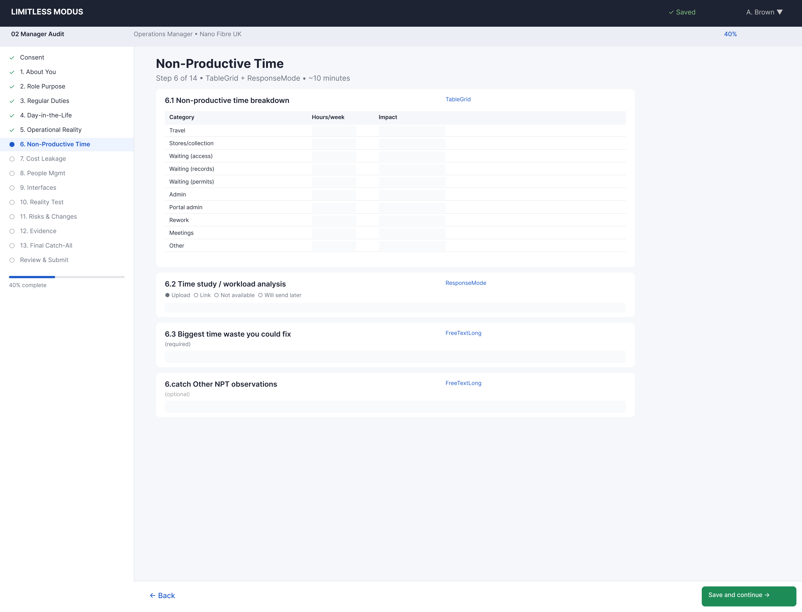

| Property | Value |
|----------|-------|
| Step number | 6 of 14 |
| Section | 6 — Non-Productive Time |
| Questions | 2 |
| Question types | TableGrid (1), ResponseMode (1) |

### Question Inventory

| # | Label | Type | Required |
|---|-------|------|----------|
| 6.1 | Time loss estimates — Columns: Category / Estimate; Rows: Van-travel / Stores collection / Waiting access / Waiting records / Waiting permits / Rework / Admin / Portal admin / FSM mismatch / Other | TableGrid | Yes |
| 6.2 | Time capture uploads | ResponseMode | No |

### Design Notes

- Compact step with one key table and one optional upload.
- The 10-row category table is consistent across all three audit instruments for cross-referencing.

---

# Step 7 — Section 7: Cost Leakage

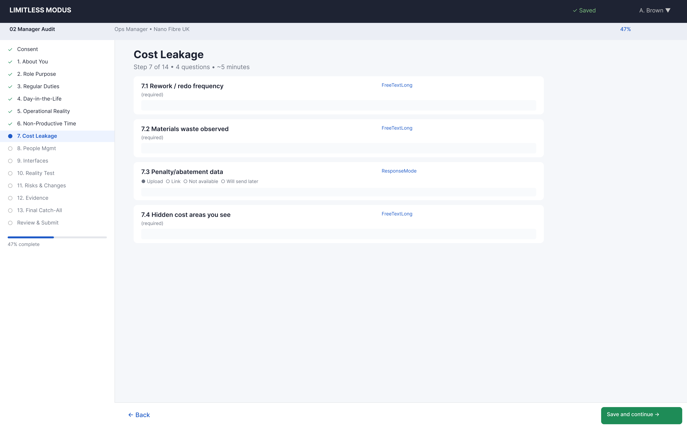

| Property | Value |
|----------|-------|
| Step number | 7 of 14 |
| Section | 7 — Cost Leakage |
| Questions | 5 |
| Question types | FreeTextLong (4), ResponseMode (1) |

### Question Inventory

| # | Label | Type | Required |
|---|-------|------|----------|
| 7.1 | Top 5 avoidable costs in your area | FreeTextLong | Yes |
| 7.2 | What spend feels normal but is waste | FreeTextLong | Yes |
| 7.3 | Where penalties/chargebacks/credits arise | FreeTextLong | Yes |
| 7.4 | Portal/commercial rules creating avoidable cost | FreeTextLong | Yes |
| 7.5 | Cost leakage uploads | ResponseMode | No |

---

# Step 8 — Section 8: People Management

| Property | Value |
|----------|-------|
| Step number | 8 of 14 |
| Section | 8 — People Management & Disciplinaries |
| Questions | 4 |
| Question types | NumberInput (1), FreeTextLong (3) |

### Question Inventory

| # | Label | Type | Required |
|---|-------|------|----------|
| 8.1 | Open disciplinaries count | NumberInput | Yes (if line mgr) |
| 8.2 | Where disciplinaries stall | FreeTextLong | Yes (if line mgr) |
| 8.3 | Top 3 conduct/performance themes | FreeTextLong | Yes (if line mgr) |
| 8.4 | What support/tools would help | FreeTextLong | No |

### Design Notes

- Questions 8.1–8.3 are conditionally required based on whether the respondent manages staff directly.
- NumberInput (8.1) is a simple numeric field with no unit.

---

# Step 9 — Section 9: Interfaces & Handoffs

| Property | Value |
|----------|-------|
| Step number | 9 of 14 |
| Section | 9 — Interfaces, Handoffs & Conflicts |
| Questions | 5 |
| Question types | FreeTextLong (5) |

### Question Inventory

| # | Label | Type | Required |
|---|-------|------|----------|
| 9.1 | 3 teams you depend on most + what you need | FreeTextLong | Yes |
| 9.2 | 3 teams that depend on you + what they need | FreeTextLong | Yes |
| 9.3 | Where handoffs break and consequences | FreeTextLong | Yes |
| 9.4 | One interface/handoff to fix tomorrow | FreeTextLong | Yes |
| 9.5 | Where system handoffs break | FreeTextLong | Yes |

### Design Notes

- Pure narrative capture — all FreeTextLong.
- Questions are structured as mirror pairs (you depend on / depend on you) for interface mapping.

---

# Step 10 — Section 10: Reality Test

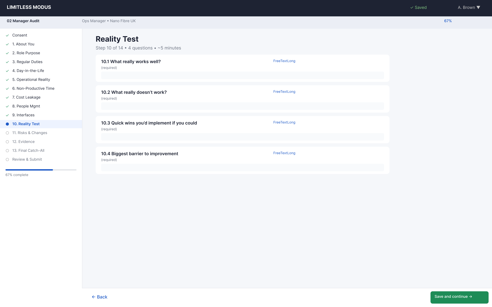

| Property | Value |
|----------|-------|
| Step number | 10 of 14 |
| Section | 10 — Reality Test |
| Questions | 2 |
| Question types | RatingScaleWithEvidence (2) |

### Question Inventory

| # | Label | Type | Required |
|---|-------|------|----------|
| 10.1 | Standard items rating (9 items: Planning & scheduling / Dispatch rules / QA gates / Repeat fault loop / Stores control / HSEQ controls / KPI reporting / FSM-portal integration / Portal closure rules) — 9-point rating + evidence description + optional file per item | RatingScaleWithEvidence | Yes |
| 10.2 | Additional items (up to 5) | RatingScaleWithEvidence | No |

### Design Notes

- Manager's version of the Reality Test uses 9 items (vs Company Audit's 10) with a 9-point scale.
- Rating options: Exists and is used / Exists but not consistently / Claimed but can't be found / Exists but under-resourced / Implemented but no effect / Tool used for wrong purpose / Conflicting approaches / Works only because key people / Not applicable.
- Each item has a rating dropdown + free text evidence description + optional file upload — the most complex UI component in the wizard.

---

# Step 11 — Section 11: Risks & Changes

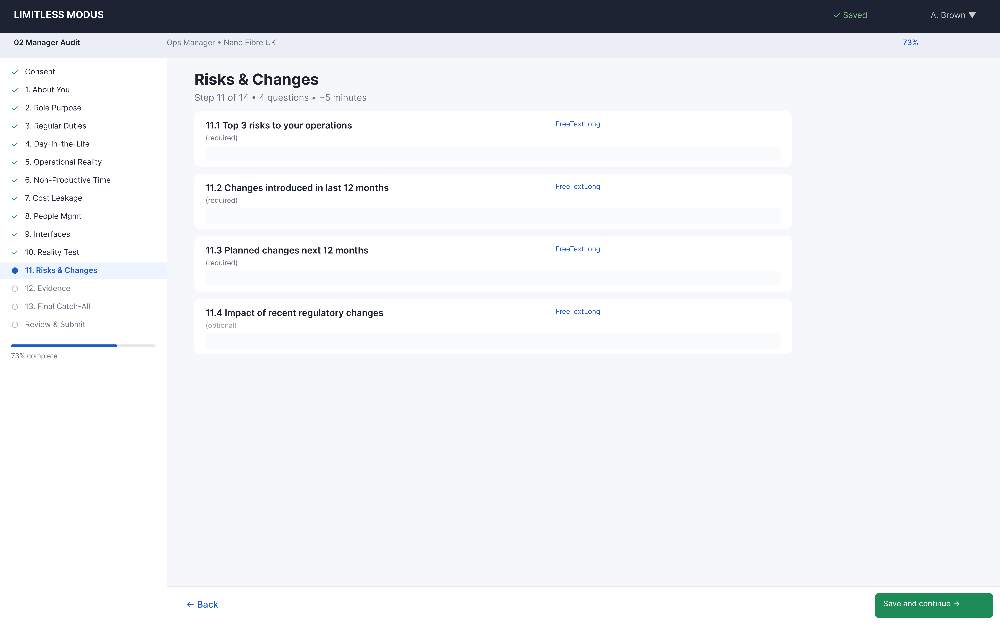

| Property | Value |
|----------|-------|
| Step number | 11 of 14 |
| Section | 11 — Risks, Constraints & What You Would Change |
| Questions | 4 |
| Question types | FreeTextLong (4) |

### Question Inventory

| # | Label | Type | Required |
|---|-------|------|----------|
| 11.1 | Top 5 constraints blocking performance | FreeTextLong | Yes |
| 11.2 | Risks you worry about most | FreeTextLong | Yes |
| 11.3 | One change without extra headcount | FreeTextLong | Yes |
| 11.4 | One investment you would request | FreeTextLong | Yes |

---

# Step 12 — Section 12: Evidence Register

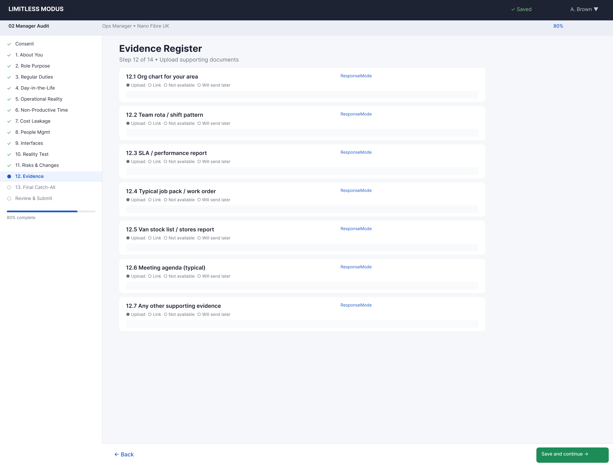

| Property | Value |
|----------|-------|
| Step number | 12 of 14 |
| Section | 12 — Evidence Uploads |
| Questions | 1 |
| Question types | ChecklistUpload (1) |

### Question Inventory

| # | Label | Type | Required |
|---|-------|------|----------|
| 12.1 | Evidence upload checklist — Items (14): Local trackers / KPI packs / Rotas / Checklists-SOPs / Meeting notes / Audit results / Exception lists / Portal guides / Job pack requirements / Rejection reasons / Reconciliation trackers / Free-issue statements / Inventory reports / Other | ChecklistUpload | Encouraged |

### Design Notes

- A single ChecklistUpload with 14 item categories, each with a ResponseMode sub-field.
- This captures the bulk of supporting evidence in a structured, categorised format.

---

# Step 13 — Section 13: Final Catch-All

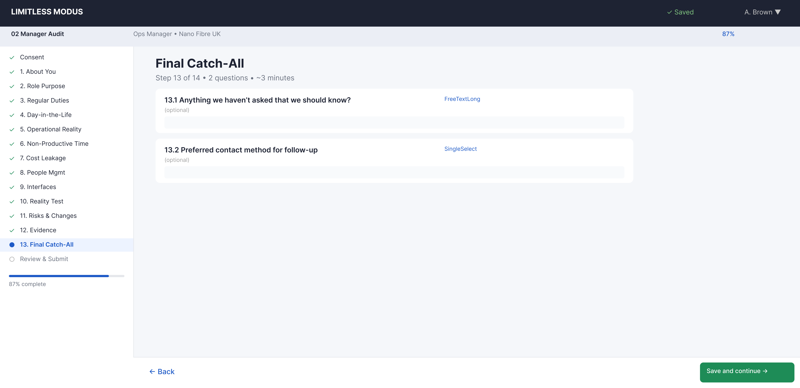

| Property | Value |
|----------|-------|
| Step number | 13 of 14 |
| Section | 13 — Final Catch-All |
| Questions | 2 |
| Question types | FreeTextLong (2) |

### Question Inventory

| # | Label | Type | Required |
|---|-------|------|----------|
| 13.1 | What else exists that would help us | FreeTextLong | Yes |
| 13.2 | Anything we should not misunderstand | FreeTextLong | No |

### Design Notes

- Deliberately open-ended — gives respondents a final opportunity to share anything not covered.
- Short and fast to complete, positioned just before the review step.

---

# Step 14 — Review & Submit

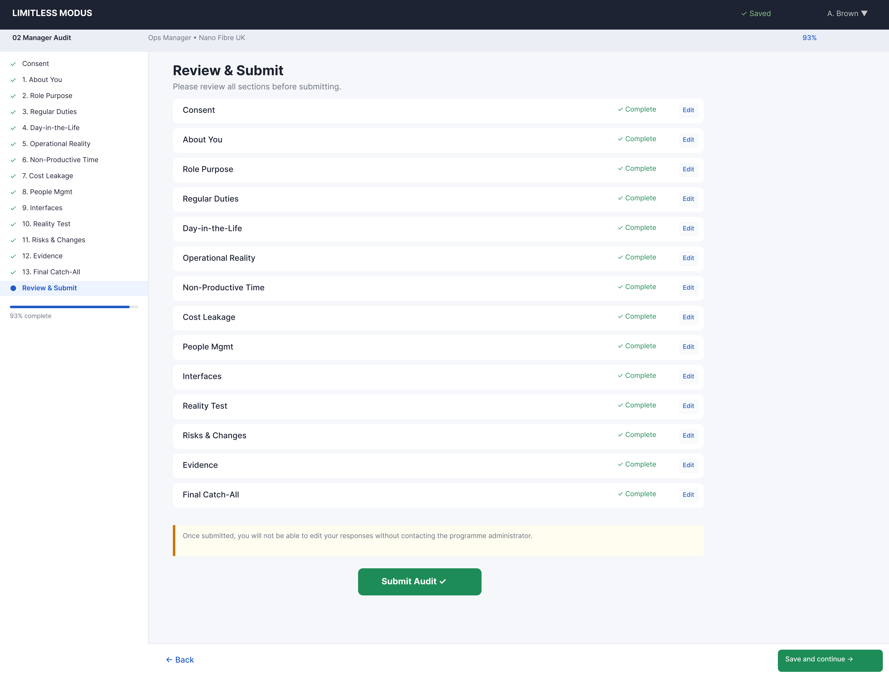

| Property | Value |
|----------|-------|
| Step number | 14 of 14 |
| Section | Review & Submit |
| Questions | 0 (summary view) |

### Design Notes

- Read-only summary of all completed sections with completion badges.
- "Submit Audit" button replaces "Save and continue".
- Respondents can click any section to return and edit before submission.
- Section 5 shows whichever variant was routed to the participant.

---

## Appendix — Section 5 Routing Summary

| Department (Q1.3) | Variant | Questions | Unique Figma Frame |
|-------------------|---------|-----------|-------------------|
| Field Ops – Installations | 5.1 | 7 | Representative |
| Field Ops – Service Calls/Repair | 5.2 | 6 | Representative |
| Field Ops – Pre-Enablement | 5.3 | 6 | Representative |
| Field Ops – Enablement Works | 5.4 | 6 | Representative |
| Dispatch/Scheduling | 5.5 | 8 | Dispatch |
| Stores/Materials | 5.6 + 5.6B + 5.6C | 22 | Stores |
| QA/Quality | 5.7 | 6 | Representative |
| HSEQ | 5.8 | 5 | Representative |
| HR | 5.9 | 5 | Representative |
| Other | — | 0 (skip) | — |

## Appendix — Question Type Inventory

| Type | Count | Steps Used In |
|------|-------|---------------|
| FreeTextLong | ~65 (base) + variable (Sec 5) | Steps 2–13 |
| ResponseMode | ~10 | Steps 2–7, 12 |
| MultiSelect + FreeTextLong | 2 | Step 5 (Dispatch) |
| MultiSelect | 2 | Step 4 |
| SingleSelect | 3 | Steps 1, 5 (Stores) |
| RatingScaleWithEvidence | 2 | Step 10 |
| TableGrid | 2 | Steps 3, 6 |
| ChecklistUpload | 1 | Step 12 |
| NumberInput | 1 | Step 8 |
| FreeText | 6 | Step 1 |
| ConsentCheckbox | 1 | Step 0 |

## Appendix — Figma Node Reference

| Step | Frame Name | Node ID |
|------|-----------|---------|
| 0 | 02-Step0 Consent | `2010:2078` |
| 1 | 02-Step1 About You | `2010:2134` |
| 2 | 02-Step2 Role Purpose | `2010:2210` |
| 3 | 02-Step3 Regular Duties | `2010:2282` |
| 4 | 02-Step4 Day-in-the-Life | `2010:2355` |
| 5 (rep) | 02-Step5 Sec5 Representative (Installations) | `2011:2493` |
| 5 (dispatch) | 02-Step5.5 Dispatch (unique variant) | `2011:2584` |
| 5 (stores) | 02-Step5.6 Stores/Materials (unique variant) | `2011:2696` |
| 6 | 02-Step6 Non-Productive Time | `2011:2861` |
| 7 | 02-Step7 Cost Leakage | `2011:2985` |
| 8 | 02-Step8 People Management | `2011:3057` |
| 9 | 02-Step9 Interfaces | `2011:3132` |
| 10 | 02-Step10 Reality Test | `2011:3209` |
| 11 | 02-Step11 Risks & Changes | `2011:3281` |
| 12 | 02-Step12 Evidence Register | `2011:3353` |
| 13 | 02-Step13 Final Catch-All | `2011:3440` |
| 14 | 02-Review Review & Submit | `2011:3502` |

## Related Files

- **Specification:** [wizard-specification.md](wizard-specification.md)
- **Figma layouts overview:** [wizard-figma-layouts.md](wizard-figma-layouts.md)
- **Figma project:** Limitless Modus Portal → Wizard — Audit Self-submission → 02 Manager Audit section
