https://nano.limitlessmodus.com/# 03 Engineer Mini-Audit — Wizard UI Layouts

> **Instrument:** Invincibility Blueprint — Engineer Mini-Audit
> **Audience:** Field engineers (all streams)
> **Total steps:** 12 (Consent + Sections 1–10 + Review)
> **Estimated time:** 10–12 minutes
> **Conditional logic:** Section 5 routes by job type (selected in Section 1); multi-skilled engineers answer up to 2 modules
> **Figma section:** "03 — Engineer Mini-Audit" in Wizard — Audit Self-submission page
> **Figma project:** Limitless Modus Portal

---

# Step 0 — Confidentiality & Consent

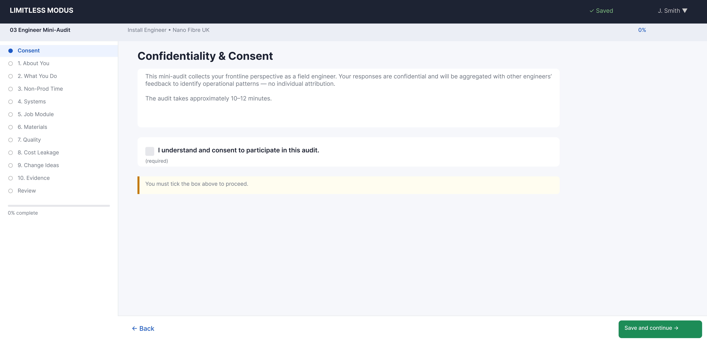

| Property | Value |
|----------|-------|
| Step number | 0 of 11 |
| Section | Consent |
| Questions | 2 (1 display + 1 interactive) |
| Question types | ConsentCheckbox |
| Gate | Cannot proceed until consent is checked |

### Question Inventory

| # | Label | Type | Required |
|---|-------|------|----------|
| 0.1 | Confidentiality + purpose statement | Display only | — |
| 0.2 | Consent checkbox | ConsentCheckbox | Yes — gate |

### Design Notes

- Compact consent screen with combined confidentiality statement and purpose explanation.
- Single interactive element (consent checkbox) gates the "Save and continue" button.
- Designed for mobile-first experience — engineers complete this on their phones.

---

# Step 1 — Section 1: About You

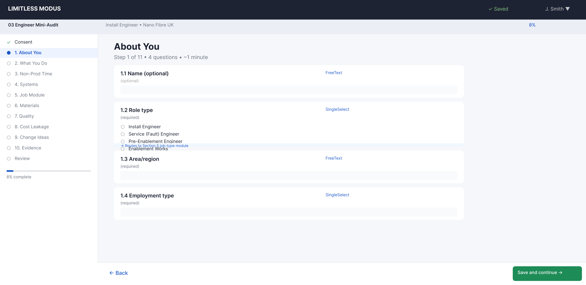

| Property | Value |
|----------|-------|
| Step number | 1 of 11 |
| Section | 1 — About You |
| Questions | 4 |
| Question types | FreeText (2), SingleSelect (2) |
| Routing trigger | Question 1.2 determines Section 5 module(s) |

### Question Inventory

| # | Label | Type | Required |
|---|-------|------|----------|
| 1.1 | Name (optional — can be anonymous) | FreeText | No |
| 1.2 | Role type — Options: Install Engineer / Service (Fault) Engineer / Pre-Enablement Engineer / Enablement Works / Multi-skilled | SingleSelect | Yes |
| 1.3 | Area/region | FreeText | Yes |
| 1.4 | Employment type — Options: Employed / Subcontractor / Other | SingleSelect | Yes |

### Design Notes

- Name is explicitly optional — engineers can submit anonymously.
- Question 1.2 is the routing trigger. "Multi-skilled" selection prompts a secondary picker for up to 2 job-type modules.
- Minimal fields — designed to be completed in under 1 minute.

---

# Step 2 — Section 2: What You Do & What "Good" Looks Like

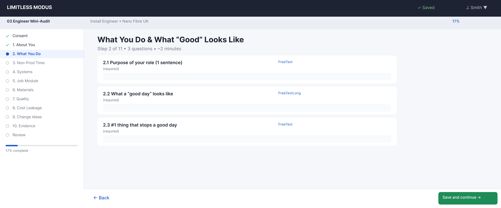

| Property | Value |
|----------|-------|
| Step number | 2 of 11 |
| Section | 2 — What You Do & What "Good" Looks Like |
| Questions | 3 |
| Question types | FreeText (2), FreeTextLong (1) |

### Question Inventory

| # | Label | Type | Required |
|---|-------|------|----------|
| 2.1 | Purpose of your role (1 sentence) | FreeText | Yes |
| 2.2 | What a "good day" looks like (1–2 bullets) | FreeTextLong | Yes |
| 2.3 | #1 thing that stops a good day | FreeText | Yes |

### Design Notes

- Deliberately brief and conversational — 3 questions in natural language.
- "1 sentence" and "1–2 bullets" guidance keeps responses focused and fast.
- This is the identity framing step — establishes the engineer's self-perception before diagnostic questions begin.

---

# Step 3 — Section 3: Non-Productive Time

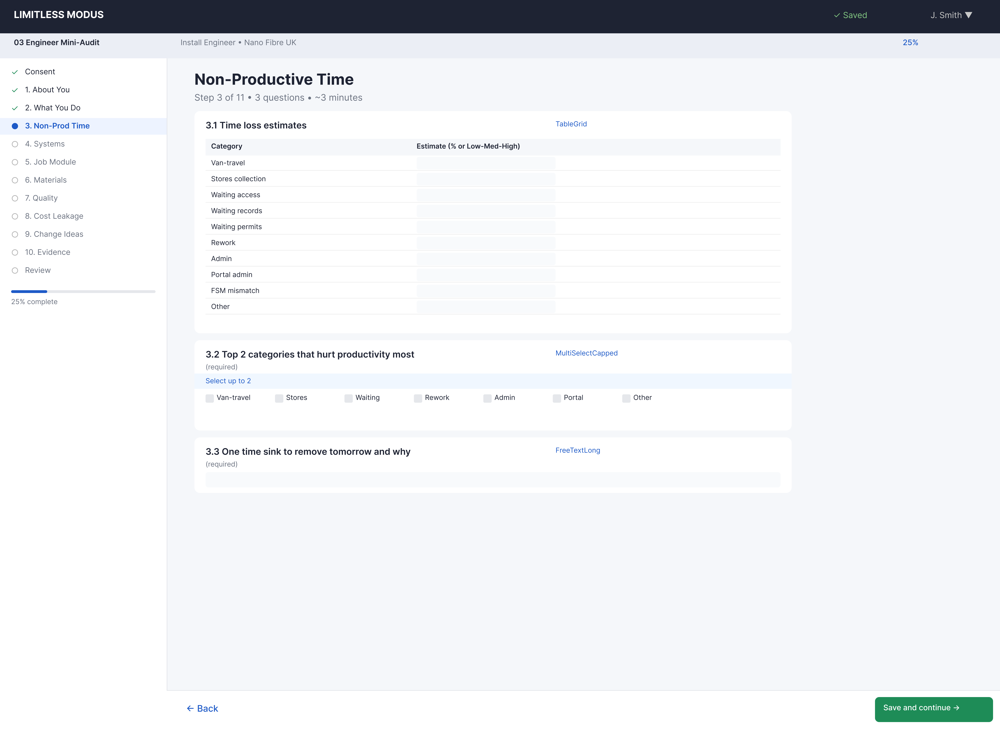

| Property | Value |
|----------|-------|
| Step number | 3 of 11 |
| Section | 3 — Non-Productive Time |
| Questions | 3 |
| Question types | TableGrid (1), MultiSelectCapped (1), FreeTextLong (1) |

### Question Inventory

| # | Label | Type | Required |
|---|-------|------|----------|
| 3.1 | Time loss estimates — Columns: Category / Estimate (% or Low-Med-High); Rows: Van-travel / Stores collection / Waiting access / Waiting records / Waiting permits / Rework / Admin / Portal admin / FSM mismatch / Other | TableGrid | Yes |
| 3.2 | Top 2 categories that hurt productivity most | MultiSelectCapped (max 2) | Yes |
| 3.3 | One time sink to remove tomorrow and why | FreeTextLong | Yes |

### Design Notes

- The 10-row time loss table is consistent across all three audit instruments for cross-referencing.
- Engineers can use either percentages or Low/Med/High — flexibility for mobile input.
- MultiSelectCapped (3.2) limits selection to 2 items, forcing prioritisation.

---

# Step 4 — Section 4: Systems & Portals Friction

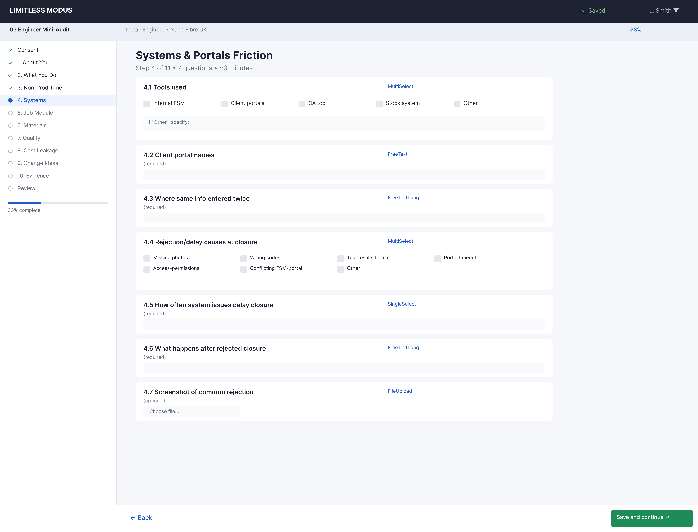

| Property | Value |
|----------|-------|
| Step number | 4 of 11 |
| Section | 4 — Systems & Portals Friction |
| Questions | 7 |
| Question types | MultiSelect (2), FreeText (1), FreeTextLong (2), SingleSelect (1), FileUpload (1) |

### Question Inventory

| # | Label | Type | Required |
|---|-------|------|----------|
| 4.1 | Tools used — Options: Internal FSM / Client portals / QA tool / Stock system / Other | MultiSelect | Yes |
| 4.2 | Client portal names | FreeText | Conditional (4.1 includes Client portals) |
| 4.3 | Where same info entered twice | FreeTextLong | Yes |
| 4.4 | Rejection/delay causes at closure — Options: Missing photos / Wrong codes / Test results format / Portal timeout / Access-permissions / Conflicting FSM-portal / Other | MultiSelect | Yes |
| 4.5 | How often system/portal issues delay closure — Options: Daily / Weekly / Monthly / Rarely / Never | SingleSelect | Yes |
| 4.6 | What happens after rejected closure | FreeTextLong | Yes |
| 4.7 | Screenshot of common rejection | FileUpload | No |

### Design Notes

- The most question-dense step in the Engineer Mini-Audit (7 questions).
- MultiSelect questions (4.1, 4.4) use checkbox groups — large touch targets for mobile.
- FileUpload (4.7) supports camera capture on mobile — engineers can photograph a portal screen.
- Question 4.5 uses a frequency scale consistent with the materials question (6.1).

---

# Step 5 — Section 5: Job Type Modules (Conditional)

Section 5 routes by the role type selected in Step 1 (question 1.2). There are 4 modules, and multi-skilled engineers see up to 2. All 4 modules share the same Figma layout structure — the representative frame is used for all.

## Step 5 — Module 5A: Installations

| Property | Value |
|----------|-------|
| Section | 5A — Installations |
| Questions | 4 |
| Question types | MultiSelectCapped (1), FreeTextLong (3) |
| Condition | Role type = Install Engineer or Multi-skilled (with Installations selected) |

### Question Inventory

| # | Label | Type | Required |
|---|-------|------|----------|
| 5A.1 | Top 5 install failure reasons — Options: Access issue / Wrong-missing kit / Network not ready / Pre-enablement incomplete / Enablement-civils required / Poor job data / Unrealistic time window / Quality standard unclear / Portal evidence rules / Other | MultiSelectCapped (max 5) | Yes |
| 5A.2 | What creates repeat visits most on installs | FreeTextLong | Yes |
| 5A.3 | One change to improve Right First Time | FreeTextLong | Yes |
| 5A.4 | Throughput check: done-on-site but not paid — frequency and cause | FreeTextLong | Yes |

> **Figma note:** This frame represents all 4 job-type modules. The layout structure is identical — only question labels, option lists, and counts differ per module.

## Step 5 — Module 5B: Service Calls / Fault

*Uses the same Figma layout as 5A.*

| # | Label | Type | Required |
|---|-------|------|----------|
| 5B.1 | Top 5 fault types | FreeTextLong | Yes |
| 5B.2 | Biggest repeat fault causes (up to 3) — Options: Wrong diagnosis / Parts unavailable / Network issue / Evidence constraints / Customer access / Time pressure / Other | MultiSelectCapped (max 3) | Yes |
| 5B.3 | Where fault-to-fix stalls most | FreeTextLong | Yes |
| 5B.4 | What would reduce repeat faults fastest | FreeTextLong | Yes |
| 5B.5 | Throughput check: done-but-not-paid | FreeTextLong | Yes |

## Step 5 — Module 5C: Pre-Enablement

*Uses the same Figma layout as 5A.*

| # | Label | Type | Required |
|---|-------|------|----------|
| 5C.1 | Most common outcomes (up to 2) — Options: Ready for install / Blocked – needs enablement / Blocked – access / Reschedule / Job data wrong / Other | MultiSelectCapped (max 2) | Yes |
| 5C.2 | Biggest "not ready" cause | FreeTextLong | Yes |
| 5C.3 | Evidence/info for install handover | FreeTextLong | Yes |
| 5C.4 | Where pre-enablement reduces/creates waste | FreeTextLong | Yes |
| 5C.5 | Throughput check: done-but-not-paid | FreeTextLong | Yes |

## Step 5 — Module 5D: Enablement Works

*Uses the same Figma layout as 5A.*

| # | Label | Type | Required |
|---|-------|------|----------|
| 5D.1 | Top 5 enablement job types | FreeTextLong | Yes |
| 5D.2 | Biggest delay causes (up to 3) — Options: Permits-TM / Materials-kit / Access / Scope unclear / Coordination / Portal approvals / Other | MultiSelectCapped (max 3) | Yes |
| 5D.3 | Biggest rework drivers | FreeTextLong | Yes |
| 5D.4 | One change to reduce cycle time | FreeTextLong | Yes |
| 5D.5 | Throughput check: done-but-not-paid | FreeTextLong | Yes |

### Multi-Skilled Routing

When "Multi-skilled" is selected in question 1.2:
1. A secondary picker appears: "Which two work types represent most of your week? (select 2)"
2. Options: Installations / Service / Pre-Enablement / Enablement
3. The two selected modules appear in sequence as Step 5a and Step 5b.
4. If only one is selected, just that module appears.

---

# Step 6 — Section 6: Materials, Inventory & Free-Issue

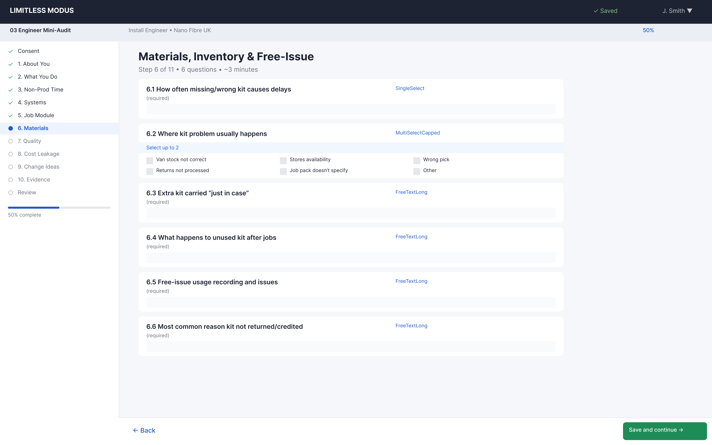

| Property | Value |
|----------|-------|
| Step number | 6 of 11 |
| Section | 6 — Materials, Inventory & Free-Issue |
| Questions | 6 |
| Question types | SingleSelect (1), MultiSelectCapped (1), FreeTextLong (4) |

### Question Inventory

| # | Label | Type | Required |
|---|-------|------|----------|
| 6.1 | How often missing/wrong kit causes delays — Options: Daily / Weekly / Monthly / Rarely / Never | SingleSelect | Yes |
| 6.2 | Where kit problem usually happens (up to 2) — Options: Van stock not correct / Stores availability / Wrong pick / Returns not processed / Job pack doesn't specify / Other | MultiSelectCapped (max 2) | Yes |
| 6.3 | Extra kit carried "just in case" | FreeTextLong | Yes |
| 6.4 | What happens to unused kit after jobs | FreeTextLong | Yes |
| 6.5 | Free-issue usage recording and where it goes wrong | FreeTextLong | Yes |
| 6.6 | Most common reason kit not returned/credited | FreeTextLong | Yes |

### Design Notes

- Mix of structured (SingleSelect, MultiSelectCapped) and narrative (FreeTextLong) questions.
- The free-issue questions (6.5, 6.6) cross-reference with Manager Audit Section 5.6C for triangulation.

---

# Step 7 — Section 7: Quality & Safety

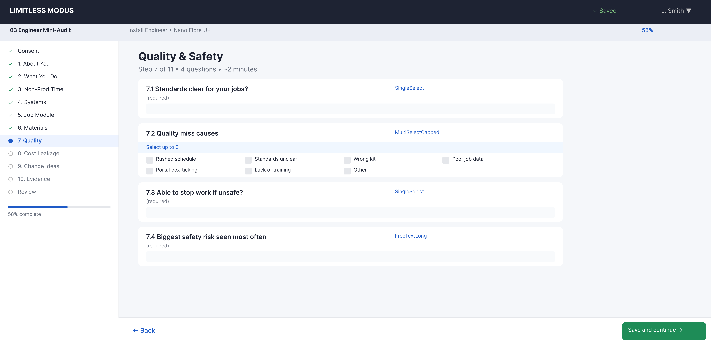

| Property | Value |
|----------|-------|
| Step number | 7 of 11 |
| Section | 7 — Quality & Safety |
| Questions | 4 |
| Question types | SingleSelect (2), MultiSelectCapped (1), FreeTextLong (1) |

### Question Inventory

| # | Label | Type | Required |
|---|-------|------|----------|
| 7.1 | Standards clear for your jobs? — Options: Always / Mostly / Sometimes / Rarely / Never | SingleSelect | Yes |
| 7.2 | Quality miss causes (up to 3) — Options: Rushed schedule / Standards unclear / Wrong kit / Poor job data / Portal box-ticking / Lack of training / Other | MultiSelectCapped (max 3) | Yes |
| 7.3 | Able to stop work if unsafe? — Options: Yes always / Yes usually / Sometimes / No | SingleSelect | Yes |
| 7.4 | Biggest safety risk seen most often | FreeTextLong | Yes |

### Design Notes

- Mostly structured answers — fast to complete on mobile.
- Question 7.3 on stop-work authority is a critical safety culture indicator.
- Only one free-text field (7.4) — keeps completion time under 2 minutes for this step.

---

# Step 8 — Section 8: Cost Leakage & Chargebacks

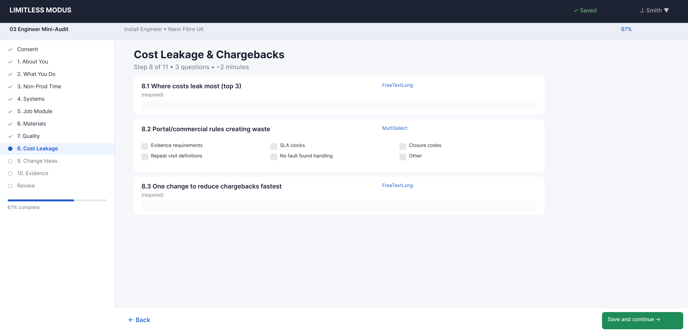

| Property | Value |
|----------|-------|
| Step number | 8 of 11 |
| Section | 8 — Cost Leakage & Chargebacks |
| Questions | 3 |
| Question types | FreeTextLong (2), MultiSelect (1) |

### Question Inventory

| # | Label | Type | Required |
|---|-------|------|----------|
| 8.1 | Where costs leak most (top 3) | FreeTextLong | Yes |
| 8.2 | Portal/commercial rules creating waste — Options: Evidence requirements / SLA clocks / Closure codes / Repeat visit definitions / No fault found handling / Other | MultiSelect | Yes |
| 8.3 | One change to reduce chargebacks fastest | FreeTextLong | Yes |

### Design Notes

- Compact step with 3 focused questions.
- MultiSelect (8.2) helps engineers identify systemic commercial friction points.
- The "one change" question (8.3) surfaces high-impact single improvements.

---

# Step 9 — Section 9: What Would You Change?

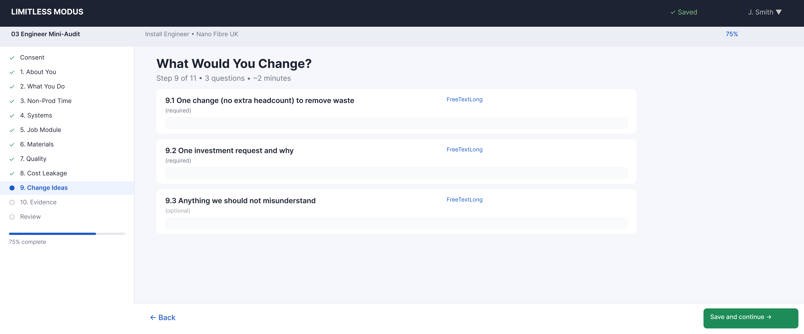

| Property | Value |
|----------|-------|
| Step number | 9 of 11 |
| Section | 9 — What Would You Change? |
| Questions | 3 |
| Question types | FreeTextLong (3) |

### Question Inventory

| # | Label | Type | Required |
|---|-------|------|----------|
| 9.1 | One change (no extra headcount) to remove waste | FreeTextLong | Yes |
| 9.2 | One investment request and why | FreeTextLong | Yes |
| 9.3 | Anything we should not misunderstand | FreeTextLong | No |

### Design Notes

- The "voice of the field" step — deliberately open-ended.
- Question 9.3 is optional but often produces the most valuable insights.
- Matches the Manager Audit's Section 11 and Company Audit's Section J for cross-instrument comparison.

---

# Step 10 — Section 10: Optional Evidence

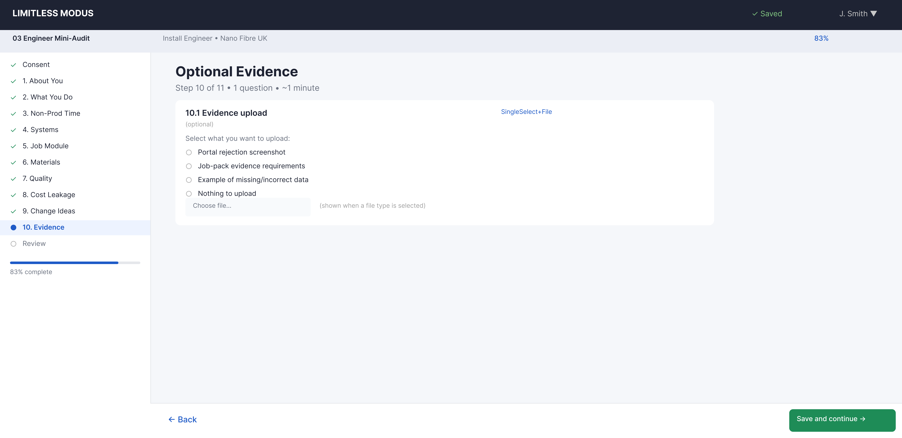

| Property | Value |
|----------|-------|
| Step number | 10 of 11 |
| Section | 10 — Optional Evidence |
| Questions | 1 |
| Question types | SingleSelect + FileUpload (1) |

### Question Inventory

| # | Label | Type | Required |
|---|-------|------|----------|
| 10.1 | Evidence upload — Options: Portal rejection screenshot / Job-pack evidence requirements / Example of missing-incorrect data / Nothing to upload | SingleSelect + FileUpload | No |

### Design Notes

- Entirely optional — engineers can select "Nothing to upload" and proceed.
- On mobile, the FileUpload triggers the device camera for direct photo capture.
- The options list guides engineers toward the most diagnostic evidence types.

---

# Step 11 — Review & Submit

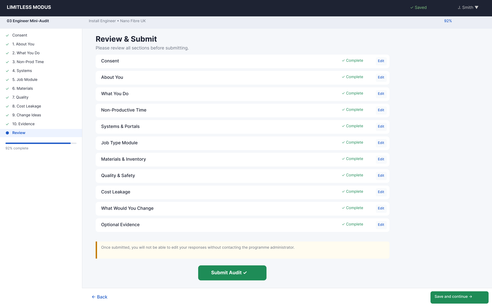

| Property | Value |
|----------|-------|
| Step number | 11 of 11 |
| Section | Review & Submit |
| Questions | 0 (summary view) |

### Design Notes

- Read-only summary of all completed sections with completion badges.
- "Submit Audit" button replaces "Save and continue".
- Respondents can tap any section to return and edit before submission.
- Section 5 shows whichever module(s) were routed to the participant.
- For multi-skilled engineers, both Section 5 modules appear in the summary.

---

## Appendix — Section 5 Routing Summary

| Role Type (Q1.2) | Module(s) Shown | Questions |
|-------------------|----------------|-----------|
| Install Engineer | 5A only | 4 |
| Service (Fault) Engineer | 5B only | 5 |
| Pre-Enablement Engineer | 5C only | 5 |
| Enablement Works | 5D only | 5 |
| Multi-skilled | Up to 2 modules (participant selects) | 4–10 |

## Appendix — Question Type Inventory

| Type | Count | Steps Used In |
|------|-------|---------------|
| FreeTextLong | ~18 (base) + variable (Sec 5) | Steps 2–9 |
| FreeText | 4 | Steps 1, 2 |
| SingleSelect | 5 | Steps 1, 4, 6, 7, 10 |
| MultiSelect | 2 | Steps 4, 8 |
| MultiSelectCapped | ~4 (base) + variable (Sec 5) | Steps 3, 5, 6, 7 |
| TableGrid | 1 | Step 3 |
| FileUpload | 2 | Steps 4, 10 |
| ConsentCheckbox | 1 | Step 0 |

## Appendix — Figma Node Reference

| Step | Frame Name | Node ID |
|------|-----------|---------|
| 0 | 03-Step0 Consent | `2012:3564` |
| 1 | 03-Step1 About You | `2012:3634` |
| 2 | 03-Step2 What You Do | `2012:3720` |
| 3 | 03-Step3 Non-Productive Time | `2012:3792` |
| 4 | 03-Step4 Systems | `2012:3862` |
| 5 | 03-Step5 Job Type Module | `2012:3966` |
| 6 | 03-Step6 Materials | `2012:4044` |
| 7 | 03-Step7 Quality Safety | `2012:4128` |
| 8 | 03-Step8 Cost Leakage | `2012:4198` |
| 9 | 03-Step9 What Would You Change | `2012:4266` |
| 10 | 03-Step10 Evidence | `2012:4338` |
| 11 | 03-Review Review & Submit | `2012:4418` |

## Appendix — Mobile Design Considerations

The Engineer Mini-Audit is optimised for mobile completion:

| Aspect | Approach |
|--------|----------|
| **Layout** | Single-column, full-width cards |
| **Touch targets** | Minimum 44px hit area for radio/checkbox |
| **Input types** | Mostly structured (SingleSelect, MultiSelect) to minimise typing |
| **Camera** | FileUpload triggers device camera for portal screenshots |
| **Progress** | Persistent progress bar + section navigator |
| **Resume** | Auto-save on every field change; can close and reopen |
| **Time** | Designed for 10–12 minute completion |
| **Anonymity** | Name field is explicitly optional |

## Related Files

- **Specification:** [wizard-specification.md](wizard-specification.md)
- **Figma layouts overview:** [wizard-figma-layouts.md](wizard-figma-layouts.md)
- **Figma project:** Limitless Modus Portal → Wizard — Audit Self-submission → 03 Engineer Mini-Audit section
