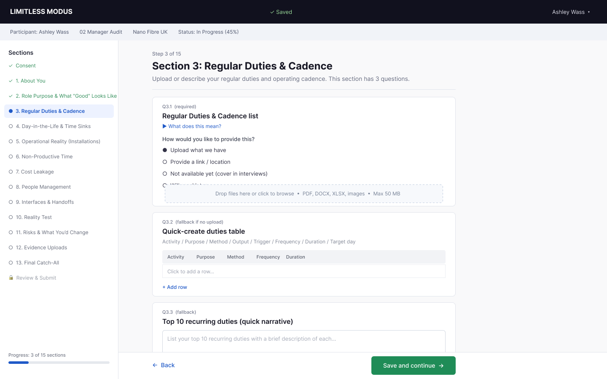
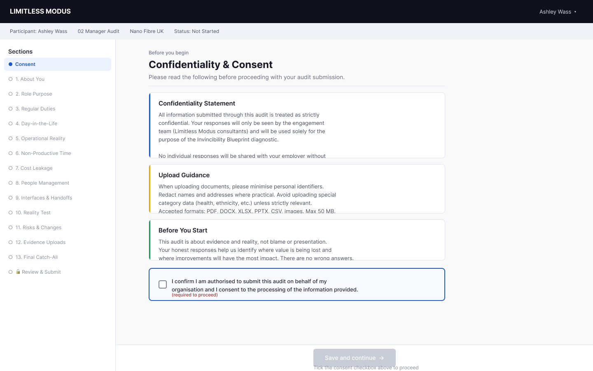
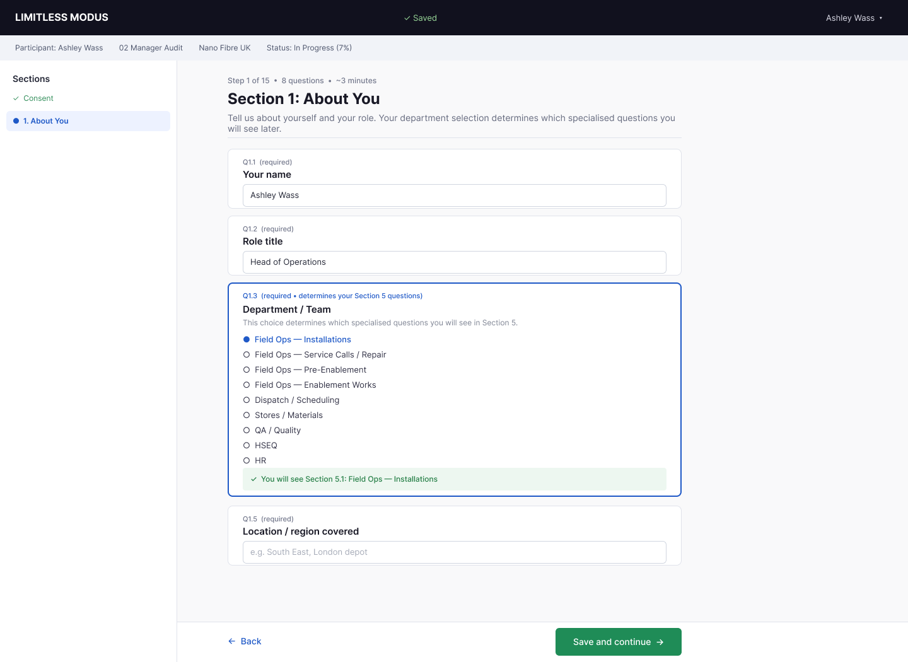
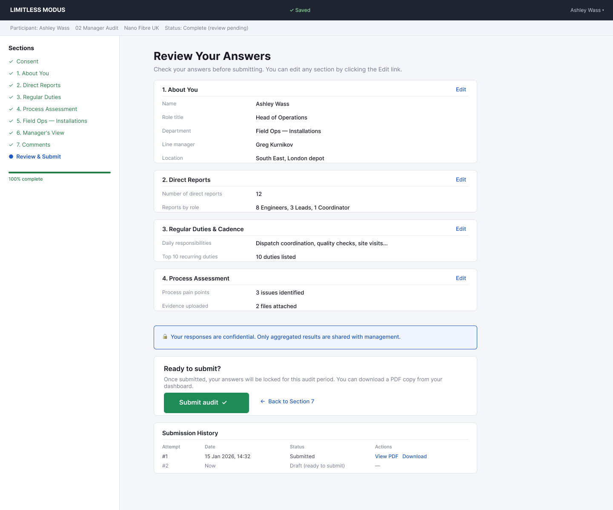
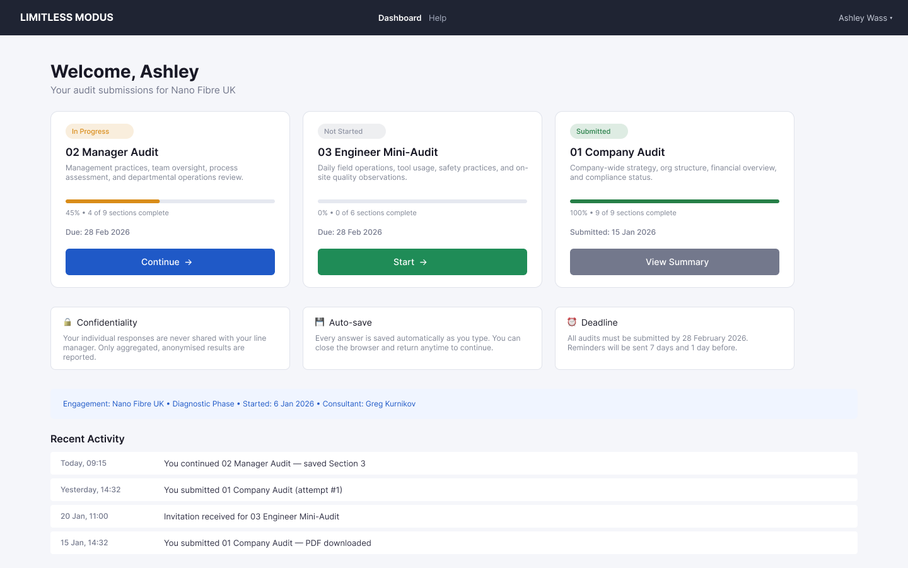
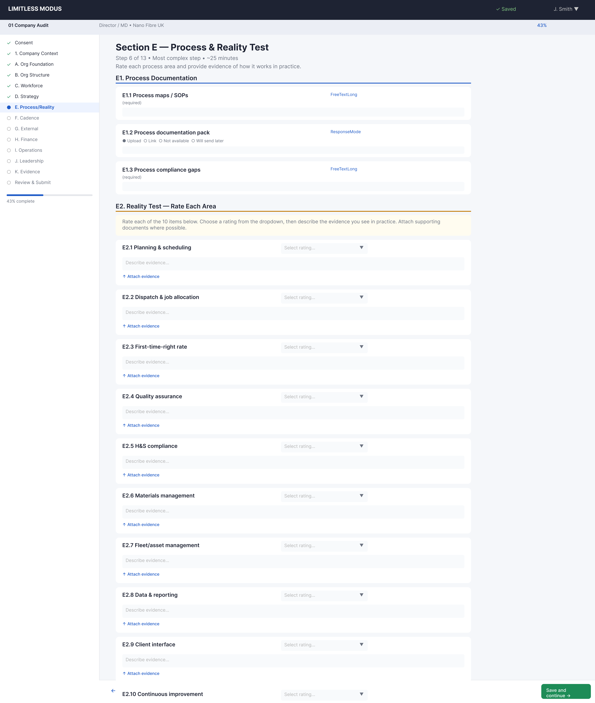
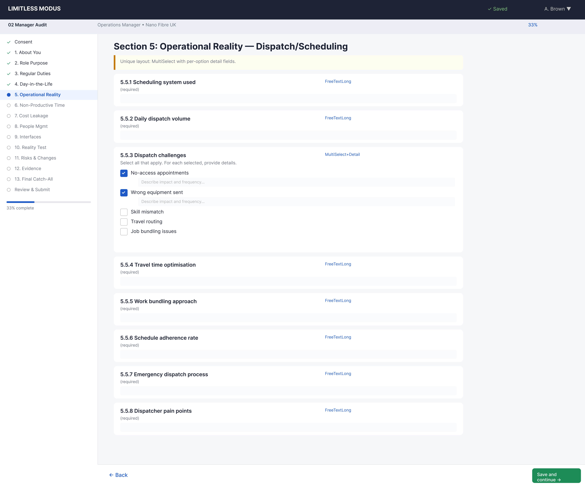
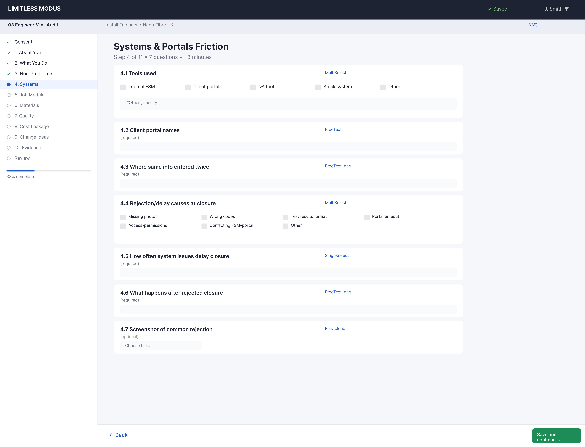

# Wizard UI Layouts

**Date:** 2 March 2026
**Figma file:** Open in Figma Desktop → Page "Wizard — Audit Self-submission"
**Status:** Complete wireframe coverage — all three wizard flows drafted, ready for refinement and DevExtreme component integration
**Based on:** [wizard-specification.md](wizard-specification.md), [wizard-ui-takeaways-hmrc.md](wizard-ui-takeaways-hmrc.md)

## Overview

**54 layout frames** were drafted in Figma covering the complete Self-submission Audit Wizard across all three instruments:

| Section | Layouts | Figma Section |
|---------|---------|---------------|
| Foundation wireframes | 5 | Wizard Layouts |
| Question type patterns | 6 | Question Type Patterns |
| 01 Company Audit | 14 | 01 — Company Audit |
| 02 Manager Audit | 17 | 02 — Manager Audit |
| 03 Engineer Mini-Audit | 12 | 03 — Engineer Mini-Audit |

All layouts use:
- **1440px desktop width** (the primary target — mobile is a future consideration)
- **Inter font family** (Regular, Medium, Semi Bold, Bold)
- **Consistent colour palette:** dark navy topbar `#1E2333`, blue accent `#1E5AC7` for interactive elements, green `#1E8C57` for success/submit, grey `#F5F7FA` background
- **Minimal chrome, maximum content** (HMRC takeaway #12)
- **Reusable wizard shell** per instrument with sidebar navigation, context banner, progress bar, and bottom nav

---

## Layout 1 — Wizard Shell (Desktop 1440)

**Purpose:** Establishes the core wizard chrome that wraps every question step.

### Structure

| Zone | Content |
|------|---------|
| **Top Bar** | Brand logo "LIMITLESS MODUS", auto-save status "✓ Saved", user dropdown |
| **Context Banner** | Participant name, instrument code, engagement name, completion status — always visible |
| **Left Sidebar** | Section navigation with completion icons (✓ complete, ● current, ○ pending), progress bar |
| **Main Content** | Section header with step counter, description, then question cards |
| **Bottom Bar** | "← Back" link + green "Save and continue →" button |

### HMRC Takeaways Demonstrated

| # | Takeaway | Implementation |
|---|----------|----------------|
| 1 | Persistent context banner | Blue-grey bar below top bar showing participant, instrument, engagement, status percentage |
| 2 | Left-hand section navigation | Sidebar with 15 sections + Consent + Review, completion icons, progress bar at bottom |
| 4 | "Save and continue" primary action | Green button, bottom-right, consistent on every step |
| 7 | Structured data grids (TableGrid) | Q3.2 shows column headers (Activity / Purpose / Method / etc.) with "Add row" |
| 8 | Mandatory vs optional distinction | "(required)" label in grey above each question |
| 9 | Contextual help | "▶ What does this mean?" expandable text under Q3.1 |
| 10 | Phase transition screens | Section header with step number, title, description, question count, estimated time |
| 12 | Minimal chrome, maximum content | Clean white cards, generous whitespace, single-column layout |

### Question Types Shown

- **Q3.1 — ResponseMode** (required): Three radio options for how to provide information (upload / link / defer), with drag-and-drop file upload zone
- **Q3.2 — TableGrid** (fallback): Column headers with an empty first row and "+ Add row" action
- **Q3.3 — FreeTextLong** (fallback): Large textarea with placeholder text

---

## Layout 2 — Consent Step (Step 0)

**Purpose:** The gated entry point. The participant must read and accept before any questions appear.

### Structure

- **Sidebar:** All sections shown as pending (○), only "Consent" is active (●)
- **Context banner:** Status shows "Not Started"
- **Three information cards** (read-only):
  - 🔵 **Confidentiality Statement** — blue left accent — explains data handling and that individual responses are never shared with the employer
  - 🟡 **Upload Guidance** — yellow accent — file formats, size limits, redaction advice
  - 🟢 **Before You Start** — green accent — sets the tone: evidence over polish, no blame, no wrong answers
- **ConsentCheckbox gate:** Checkbox with explicit consent text and "(required to proceed)" label
- **Disabled "Save and continue"** button with helper text: "Tick the consent checkbox above to proceed"

### Design Decisions

- The button is visually greyed out (disabled state) to make the gate obvious
- The consent text is legally precise: "I confirm I am authorised to submit this audit on behalf of my organisation and I consent to the processing of the information provided"
- Colour-coded info cards break up a text-heavy page and create visual hierarchy

---

## Layout 3 — Profile Step (Section 1: About You)

**Purpose:** Demonstrates a typical question page with mixed input types, including the critical routing question that determines Section 5 content.

### Structure

- **Section header:** "Step 1 of 15 · 8 questions · ~3 minutes" + title + description
- **Q1.1 Your name** — FreeText, required, pre-filled with "Ashley Wass"
- **Q1.2 Role title** — FreeText, required, pre-filled with "Head of Operations"
- **Q1.3 Department / Team** — SingleSelect (ROUTING), 10 radio options
- **Q1.5 Location** — FreeText, required, placeholder shown

### HMRC Takeaways Demonstrated

| # | Takeaway | Implementation |
|---|----------|----------------|
| 3 | Hybrid "one question per page" | 3-5 related questions per page rather than strict one-per-page |
| 6 | Answer confirmation (routing) | Green banner below Q1.3: "✓ You will see Section 5.1: Field Ops — Installations" |
| 8 | Mandatory vs optional | "(required)" on all fields; Q1.3 additionally notes "determines your Section 5 questions" |

### Routing Question Design

Q1.3 is visually distinct from other questions:
- **Blue border** (2px) instead of grey, drawing attention to its importance
- **Blue label text** indicating it affects routing
- **Helper text** explaining the consequence: "This choice determines which specialised questions you will see in Section 5"
- **Green confirmation banner** at bottom showing the resulting section path after selection

The 10 department options match the specification:
Field Ops — Installations, Field Ops — Service Calls/Repair, Field Ops — Pre-Enablement, Field Ops — Enablement Works, Dispatch/Scheduling, Stores/Materials, QA/Quality, HSEQ, HR, Other.

---

## Layout 4 — Review & Submit

**Purpose:** The final step before submission. Shows all answers in a structured summary with edit capability.

### Structure

- **Sidebar:** All 8 sections marked complete (✓ green), "Review & Submit" current (● blue), progress bar at 100%
- **Context banner:** Status shows "Complete (review pending)"
- **Title:** "Review Your Answers" with instruction text
- **Section summary cards** (one per completed section):
  - Section name as header + "Edit" link (blue, top-right)
  - Horizontal divider
  - Two-column layout: question label (grey) | answer value (dark)
- **Confidentiality reminder banner** (blue background): "🔒 Your responses are confidential. Only aggregated results are shared with management."
- **Submit area:**
  - "Ready to submit?" heading
  - Warning text about locking answers
  - Green "Submit audit ✓" button
  - "← Back to Section 7" link
- **Submission history table** (HMRC #11): Attempt number, date, status, actions (View PDF / Download)

### HMRC Takeaways Demonstrated

| # | Takeaway | Implementation |
|---|----------|----------------|
| 5 | Summary/review pages with Edit links | Four section cards with Q&A pairs and blue "Edit" link per section |
| 11 | Submission history view | Table at bottom showing previous submissions with PDF download |

### Section Summaries Shown

| Section | Sample Answers |
|---------|---------------|
| 1. About You | Name, Role, Department, Manager, Location |
| 2. Direct Reports | Count (12), Breakdown by role |
| 3. Regular Duties & Cadence | Daily responsibilities, 10 duties listed |
| 4. Process Assessment | 3 pain points, 2 files attached |

In the real implementation, all 8 sections (plus Consent) would be shown. The layout demonstrates the pattern with 4 representative sections.

---

## Layout 5 — Participant Dashboard

**Purpose:** The landing page after SSO login. Shows all assigned audit instruments and their status.

### Structure

- **Top bar:** Simplified (no wizard context banner) — logo, "Dashboard" and "Help" navigation, user dropdown
- **Welcome header:** "Welcome, Ashley" + "Your audit submissions for Nano Fibre UK"
- **Three audit cards** showing different lifecycle states:

| Card | Status | Progress | CTA |
|------|--------|----------|-----|
| 02 Manager Audit | In Progress (orange) | 45%, 4/9 sections | "Continue →" (blue) |
| 03 Engineer Mini-Audit | Not Started (grey) | 0%, 0/6 sections | "Start →" (green) |
| 01 Company Audit | Submitted (green) | 100%, 9/9 sections | "View Summary" (grey) |

- **Three info cards:** Confidentiality, Auto-save, Deadline — key reassurances for participants
- **Engagement context bar** (blue background): Engagement name, phase, start date, consultant name
- **Recent activity feed:** Timestamped log of actions (continued audit, submitted, invitation received, PDF downloaded)

### Design Decisions

- Cards use colour-coded status badges (orange/grey/green) for instant visual scanning
- Progress bars provide at-a-glance completion awareness
- The "Start" button is green (encouraging), "Continue" is blue (neutral), "View Summary" is grey (archive action)
- Info cards reinforce the three key participant concerns: confidentiality, data persistence, and deadlines

---

---

## Question Type Pattern Cards

Six new question-type pattern cards were created to establish reusable visual patterns before building full step layouts. Each card demonstrates the input type in isolation.

| Pattern | Node ID | Question Types Demonstrated |
|---------|---------|---------------------------|
| MultiSelect | `2008:6` | Checkbox grid with "Other" free-text fallback |
| MultiSelectCapped | `2008:29` | Checkbox grid with blue "Select up to N" cap indicator |
| RatingScaleWithEvidence | `2008:67` | 5-star scale with per-item ResponseMode evidence upload |
| ChecklistUpload | `2009:101` | Compact checklist rows with upload/link/NA toggle per item |
| NumberInput | `2009:162` | Numeric stepper with unit suffix |
| FileUpload (standalone) | `2009:183` | Drag-and-drop zone with file type hints |

All pattern cards are in Figma Section "Question Type Patterns" (`2008:2`).

---

## 01 — Company Audit Layouts

14 layouts covering the full Company Audit flow (Consent through Review & Submit). This is the largest instrument with the most complex question types.

*Representative layout: Step 6 (E — Process & Reality Test) showing the RatingScaleWithEvidence pattern — the most visually complex question type across all instruments.*

### Node Reference — 01 Company Audit

| Step | Section | Node ID | Key Question Types |
|------|---------|---------|-------------------|
| Step 0 | Consent | `2009:204` | ConsentCheckbox |
| Step 1 | A — Company Context | `2009:270` | FreeText, FreeTextLong, SingleSelect |
| Step 2 | B — Org Foundation | `2009:381` | ResponseMode, FreeTextLong, ChecklistUpload |
| Step 3 | C — Org Structure | `2009:525` | ResponseMode, FreeTextLong, ChecklistUpload, TableGrid |
| Step 4 | D — Workforce | `2009:632` | FreeTextLong (x14), ResponseMode (x3), NumberInput |
| Step 5 | E — Strategy | `2009:776` | FreeTextLong, ResponseMode, SingleSelect (OD Stage) |
| Step 6 | F — Process & Reality Test | `2009:885` | RatingScaleWithEvidence, FreeTextLong, ResponseMode |
| Step 7 | G — Operating Cadence | `2009:1037` | ChecklistUpload (11 schedules) |
| Step 8 | H — External System | `2009:1167` | FreeTextLong + ResponseMode |
| Step 9 | I — Finance | `2009:1242` | ResponseMode, FreeTextLong, ChecklistUpload (28 questions, 4 sub-groups) |
| Step 10 | J — Operations Deep Dive | `2009:1445` | FreeTextLong, TableGrid, SingleSelect, ChecklistUpload, ResponseMode (40+ questions, 5 sub-groups) |
| Step 11 | K — Leadership | `2010:1759` | FreeTextLong (x6) |
| Step 12 | L — Evidence Register | `2010:1839` | ResponseMode, TableGrid, FileUpload |
| Review | Review & Submit | `2010:1962` | Summary cards + Submit |

All layouts are in Figma Section "01 — Company Audit" (`2008:3`).

### Design Notes — 01

- Steps 9 (Finance) and 10 (Operations Deep Dive) use **visual sub-group dividers** with blue accent lines to break up long content into scannable sections
- Step 6 introduces the **RatingScaleWithEvidence** pattern — the most visually complex question type, with 10 rated items each having a star scale + evidence upload
- Step 7 (Operating Cadence) is a compact **ChecklistUpload**-only step with 11 schedule items
- The Company Audit sidebar has 13 sections plus Consent and Review (15 total)

---

## 02 — Manager Audit Layouts

17 layout frames covering 24 conceptual step layouts (15 base steps + 9 conditional Section 5 variants). The conditional variants use a representative layout approach: one template covers the 7 structurally similar variants, plus 2 unique layouts for Dispatch and Stores.

*Representative layout: Step 5.5 (Dispatch) — the unique conditional variant showing MultiSelect with per-option detail fields, a pattern not used elsewhere.*

### Node Reference — 02 Manager Audit (Base Steps)

| Step | Section | Node ID | Key Question Types |
|------|---------|---------|-------------------|
| Step 0 | Consent | `2010:2078` | ConsentCheckbox |
| Step 1 | About You | `2010:2134` | FreeText, SingleSelect (routing trigger) |
| Step 2 | Role Purpose | `2010:2210` | FreeTextLong (x4), ResponseMode |
| Step 3 | Regular Duties | `2010:2282` | ResponseMode, TableGrid (fallback), FreeTextLong |
| Step 4 | Day-in-the-Life | `2010:2355` | FreeTextLong, MultiSelect, ResponseMode (16 questions, 3 sub-groups) |
| Step 6 | Non-Productive Time | `2011:2861` | TableGrid (10-row), ResponseMode |
| Step 7 | Cost Leakage | `2011:2985` | FreeTextLong (x4), ResponseMode |
| Step 8 | People Management | `2011:3057` | NumberInput, FreeTextLong (conditional on line-manager status) |
| Step 9 | Interfaces | `2011:3132` | FreeTextLong (x5) |
| Step 10 | Reality Test | `2011:3209` | FreeTextLong (x4) |
| Step 11 | Risks & Changes | `2011:3281` | FreeTextLong (x4) |
| Step 12 | Evidence Register | `2011:3353` | ResponseMode (x7) |
| Step 13 | Final Catch-All | `2011:3440` | FreeTextLong (x2) |
| Review | Review & Submit | `2011:3502` | Summary cards (14 sections) + Submit |

### Node Reference — 02 Manager Audit (Conditional Section 5 Variants)

| Variant | Department | Node ID | Notes |
|---------|-----------|---------|-------|
| 5.1–5.4, 5.7–5.9 | Representative (Installations) | `2011:2493` | Covers 7 structurally identical variants (FreeTextLong + ResponseMode) |
| 5.5 | Dispatch/Scheduling | `2011:2584` | Unique: MultiSelect with per-option detail fields |
| 5.6 | Stores/Materials | `2011:2696` | Unique: 21 questions across 3 sub-groups (5.6 + 5.6B + 5.6C) |

All layouts are in Figma Section "02 — Manager Audit" (`2008:4`).

### Design Notes — 02

- The Manager Audit sidebar has 15 sections (Consent through Review), more than the other instruments
- Section 5 routing is driven by the department selected in Step 1 (Q1.3) — the sidebar shows "5. Operational Reality" and the content area changes based on department
- The representative layout for Section 5 variants includes a blue info banner noting that 6 other variants follow the same structure
- Step 4 (Day-in-the-Life) is the longest base step with 16 questions, split into 3 visual sub-groups
- Step 8 (People Management) is conditional on line-manager status, shown with a blue conditional banner

---

## 03 — Engineer Mini-Audit Layouts

12 layout frames covering 16 conceptual step layouts (12 base steps + 4 conditional Section 5 modules). All 4 modules are structurally similar, so one representative layout covers them all.

*Representative layout: Step 4 (Systems & Portals) — the most complex step in the Mini-Audit, with 7 questions across MultiSelect, FreeText, SingleSelect, and FileUpload types.*

### Node Reference — 03 Engineer Mini-Audit

| Step | Section | Node ID | Key Question Types |
|------|---------|---------|-------------------|
| Step 0 | Consent | `2011:3629` | ConsentCheckbox |
| Step 1 | About You | `2011:3683` | FreeText, SingleSelect (routing trigger) |
| Step 2 | What You Do | `2011:3760` | FreeText (x2), FreeTextLong |
| Step 3 | Non-Productive Time | `2011:3821` | TableGrid (10-row), MultiSelectCapped (max 2), FreeTextLong |
| Step 4 | Systems & Portals | `2011:3938` | MultiSelect, FreeText, FreeTextLong, SingleSelect, FileUpload |
| Step 5 | Job Module (Representative: 5A Installations) | `2011:4042` | MultiSelectCapped (max 5), FreeTextLong — covers all 4 modules |
| Step 6 | Materials & Inventory | `2011:4132` | SingleSelect, MultiSelectCapped (max 2), FreeTextLong |
| Step 7 | Quality & Safety | `2011:4220` | SingleSelect (x2), MultiSelectCapped (max 3), FreeTextLong |
| Step 8 | Cost Leakage | `2011:4300` | FreeTextLong, MultiSelect |
| Step 9 | What Would You Change | `2011:4371` | FreeTextLong (x3) |
| Step 10 | Optional Evidence | `2011:4432` | SingleSelect + FileUpload (conditional) |
| Review | Review & Submit | `2011:4494` | Summary cards (11 sections) + Submit |

All layouts are in Figma Section "03 — Engineer Mini-Audit" (`2008:5`).

### Design Notes — 03

- The Mini-Audit is designed for field engineers — steps are shorter with fewer questions per screen (max 7 questions vs 40+ in Company Audit)
- The sidebar has 12 sections (fewest of any instrument), reflecting the 10–12 minute target completion time
- Section 5 routing is driven by role type (Q1.2) — Install Engineer gets 5A, Service gets 5B, etc.
- Multi-skilled engineers see up to 2 modules in sequence (handled by a secondary picker question)
- The representative Section 5 layout includes a blue info banner noting that modules 5B, 5C, and 5D follow the same structure

---

## Foundation Wireframes — Node Reference

The original 5 wireframe layouts that established the visual system:

| Layout | Figma Node ID | Dimensions |
|--------|---------------|------------|
| Layout 1 — Wizard Shell | `2001:5` | 1440 × 900 |
| Layout 2 — Consent Step | `2002:70` | 1440 × 900 |
| Layout 3 — Profile Step | `2002:122` | 1440 × 1050 |
| Layout 4 — Review & Submit | `2002:178` | 1440 × 1200 |
| Layout 5 — Participant Dashboard | `2002:266` | 1440 × 900 |

All layouts are inside Section "Wizard Layouts" (`2001:4`) on page "Wizard — Audit Self-submission" (`2001:3`).

---

## Question Type Inventory

Across all three instruments, the following question types are used:

| Question Type | 01 Company | 02 Manager | 03 Engineer | Pattern Card |
|---------------|:----------:|:----------:|:-----------:|:------------:|
| FreeText | x | x | x | — |
| FreeTextLong | x | x | x | — |
| SingleSelect | x | x | x | — |
| MultiSelect | — | x | x | `2008:6` |
| MultiSelectCapped | — | — | x | `2008:29` |
| ConsentCheckbox | x | x | x | — |
| ResponseMode | x | x | — | — |
| TableGrid | x | x | x | — |
| FileUpload | x | — | x | `2009:183` |
| NumberInput | x | x | — | `2009:162` |
| ChecklistUpload | x | — | — | `2009:101` |
| RatingScaleWithEvidence | x | — | — | `2008:67` |

---

## Next Steps

1. **Refine in Figma** — Adjust spacing, typography scale, and colour palette to final brand guidelines
2. **DevExtreme mapping** — Map question types to specific DevExtreme components (DxTextBox, DxRadioGroup, DxDataGrid, DxFileUploader, DxProgressBar, etc.)
3. **Mobile breakpoints** — Create 375px and 768px layouts; sidebar collapses to hamburger menu for Engineer Mini-Audit (field engineer primary use case)
4. **Admin dashboard layout** — Separate layout for the engagement admin view (submission tracking, viewer, export)
5. **Component library** — Extract repeated patterns (question card, section nav item, status badge) into reusable Figma components
6. **Interaction prototyping** — Link frames into a clickable prototype for user testing
7. **Conditional routing prototype** — Wire up Section 5 routing so selecting a department/role type in Step 1 navigates to the correct module

---

## Related Files

| File | Purpose |
|------|---------|
| [wizard-specification.md](wizard-specification.md) | Full functional specification (instruments, questions, routing, data model, API) |
| [wizard-specification-plan.md](wizard-specification-plan.md) | Specification scope and structure plan |
| [wizard-ui-takeaways-hmrc.md](wizard-ui-takeaways-hmrc.md) | 12 UI patterns extracted from HMRC Company Accounts wizard |
