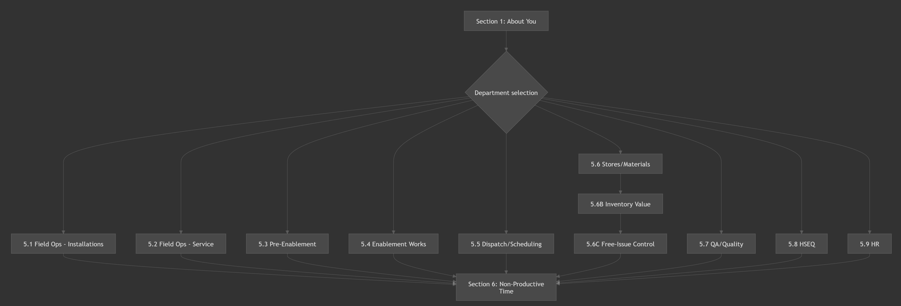
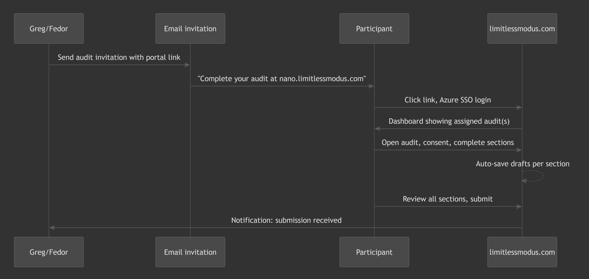

# Self-submission Audit Wizard Specification

## Context

The Invincibility Blueprint toolkit has 3 self-submission audit instruments that need to become interactive web wizards in the Limitless Portal. The instruments are defined in the toolkit:

- **01 Company Audit** (Director) — 11 sections (A–K), 60–90 min, no conditional logic
- **02 Manager Audit** (Managers) — 13 sections, 30–45 min, Section 5 branches by department
- **03 Engineer Mini-Audit** (Engineers) — 10 sections, 10–12 min, Section 5 branches by job type

First client: **Nano Fibre UK** — 27 participants, audit go-live March 10. Participant mapping in participant-instrument-mapping.md.

## What the Spec Will Cover

The specification document will be placed at `methodology/invincibility-blueprint/toolkit/wizard-specification.md` (toolkit-level, not engagement-specific) and will define:

### 1. Wizard Step Architecture

Each instrument becomes a multi-step wizard with this structure:

For each of the 3 instruments, the spec will define:

- Exact step sequence (step number, section name, estimated time)
- Which steps are mandatory vs optional
- Conditional routing rules (Section 5 branching)
- Per-step question inventory with question types

### 2. Question Type Taxonomy

Across all 3 instruments, every question maps to one of these input types:

| Type | Widget | Example |
|------|--------|---------|
| **FreeText** | Single-line or multi-line text | Most "describe" questions |
| **MultiSelect** | Checkbox groups | "Tick all that apply" |
| **SingleSelect** | Radio/dropdown | OD Stage self-assessment, role type |
| **FileUpload** | Evidence uploads with metadata | Format, what it proves |
| **TableGrid** | Structured row input | Non-productive time estimates, Regular Duties cadence |
| **RatingScale** | Rating selector (8-point scale) | Reality Test ratings |
| **ResponseMode** | "For every request, choose one" pattern | Upload / Link / Not available / Will send later |
| **ConsentCheckbox** | Required consent before proceeding | GDPR consent gate |

The spec will tag every question in every section with its type, required/optional status, and any validation rules.

### 3. Conditional Routing (Section 5)

**Manager Audit Section 5** — branches based on department selected in Section 1:

**Engineer Mini-Audit Section 5** — branches based on role type selected in Section 1 (multi-skilled can answer 2 modules).

The spec will define the exact routing rules, including how Installation Managers (who are in "Field Ops — Installations" but doing Manager Audit) get the right Section 5.

### 4. Data Model

The spec will define the submission data structure:

| Entity | Key Fields |
|--------|-----------|
| **Engagement** | Client, dates, status, instruments assigned |
| **Participant** | Name, email, role, department, assigned instruments |
| **Submission** | Participant + instrument + status (not started / in progress / submitted) |
| **Section** | Per-section draft data (JSON blob), completion status, last saved timestamp |
| **Upload** | File reference, section, question, metadata (what it proves) |

Key design decisions:

- Auto-save per section (save on navigate away)
- Draft vs submitted states
- Section-level completion tracking (progress bar)
- Submission locking after final submit (with option to unlock for amendments)

### 5. Authentication (Azure Entra ID SSO)

- Participants authenticate via Microsoft Entra ID (Azure AD)
- The spec will define: tenant configuration, redirect URIs, token handling, role mapping
- Nano Fibre UK participants use `@nanois.co.uk` and `@nanofibre.co.uk` domains
- Admin access (Greg, Fedor) via Tumai tenant

### 6. Participant Journey

### 7. Admin Dashboard

The spec will define what Greg/Fedor see:

- Engagement overview (Nano Fibre UK)
- Participant submission tracker (27 rows, columns: name, instrument, status, % complete, last activity)
- Individual submission viewer (read submitted answers, download uploads)
- Export capability (all submissions to structured data for AI synthesis)

### 8. Nano Fibre UK Specifics

The spec will include an appendix mapping the 27 Nano Fibre participants to their wizard configuration:

- Directors (Wilhelm + Dirk) — joint Company Audit, shared submission
- 21 Managers — each gets Manager Audit, Section 5 pre-routed based on department
- 4 Engineers — each gets Engineer Mini-Audit, anonymous option

## Output

One comprehensive markdown file: `methodology/invincibility-blueprint/toolkit/wizard-specification.md`

Sections:

1. Overview and design principles
2. Step flow per instrument (with question type annotations)
3. Conditional routing rules
4. Data model (entities, relationships, JSON schemas)
5. Authentication and authorisation
6. Participant journey (invitation to submission)
7. Admin dashboard requirements
8. File upload and evidence management
9. Auto-save, progress tracking, and submission lifecycle
10. Nano Fibre UK engagement configuration (appendix)
11. API contract outline (endpoints for frontend-backend communication)

## What This Does NOT Cover (deferred to implementation)

- Nuxt/Go scaffolding (next phase after spec approval)
- Visual design / Figma mockups
- Deployment and infrastructure (covered in limitless-portal CLAUDE.md)
- Interview instruments (04–06) — those are Greg-conducted, not self-submission

## Status

All specification tasks completed. The full specification document has been produced at `wizard-specification.md` alongside this plan.
