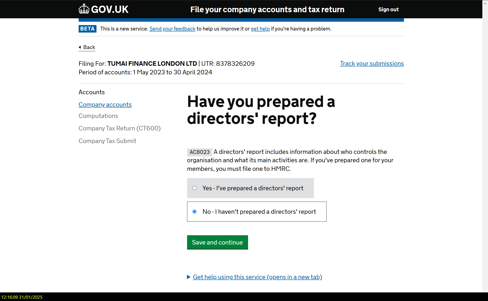
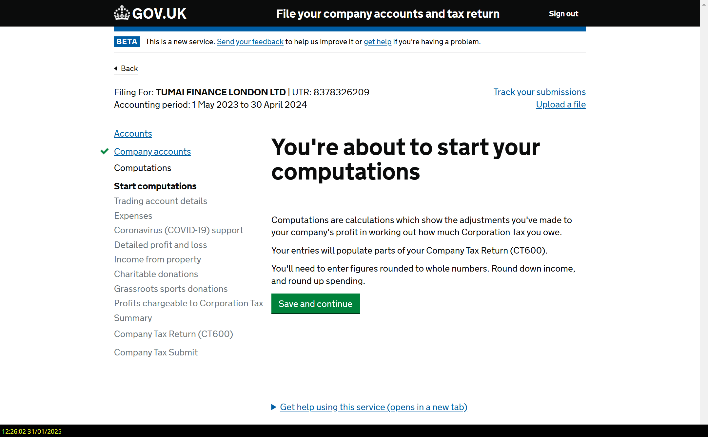
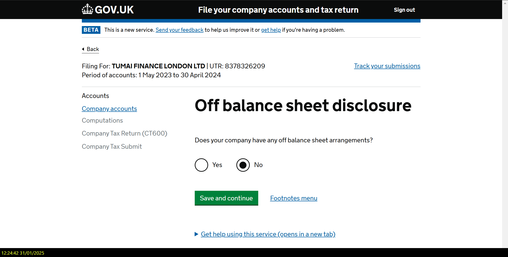
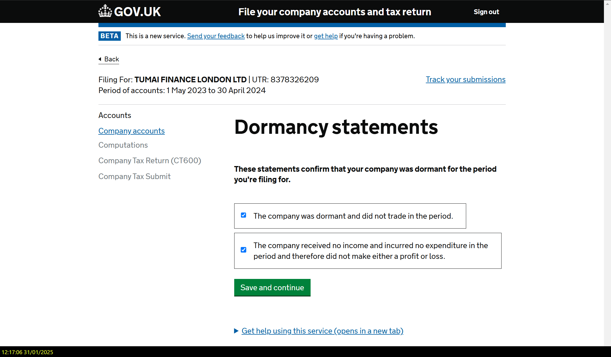
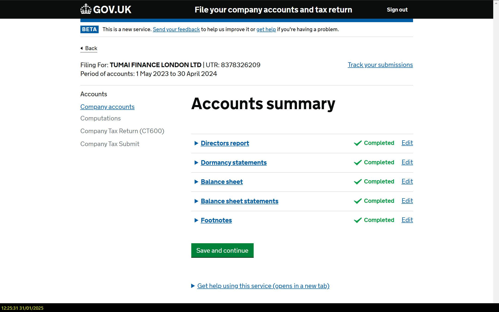
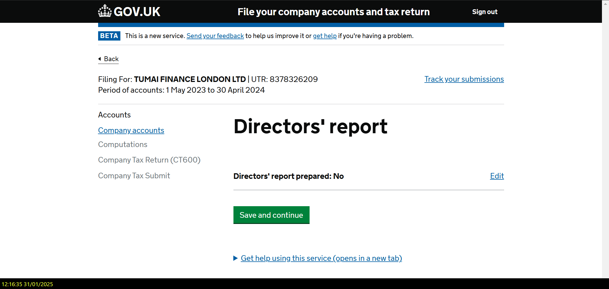
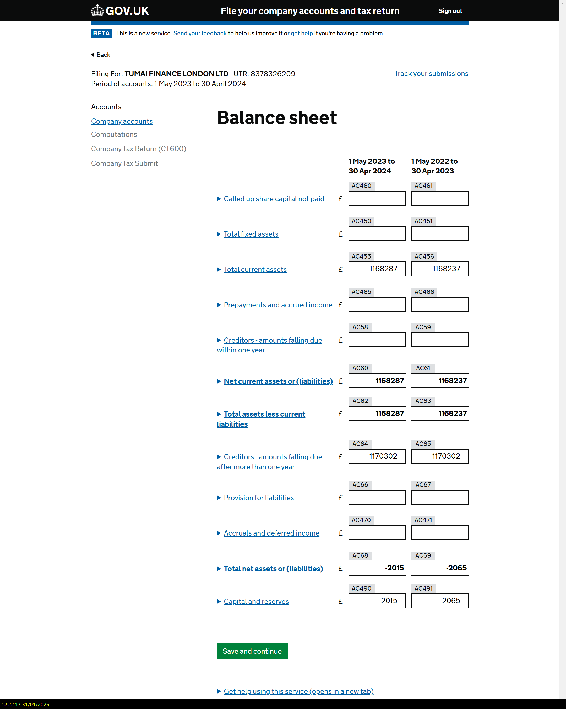
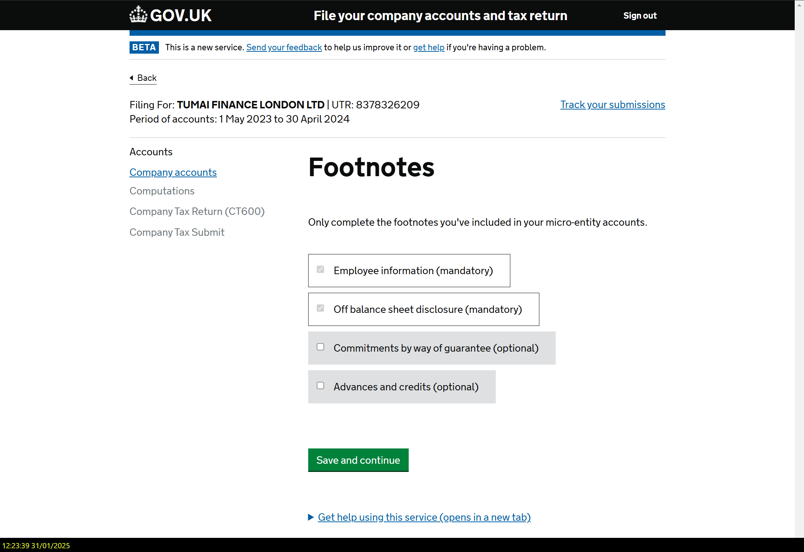
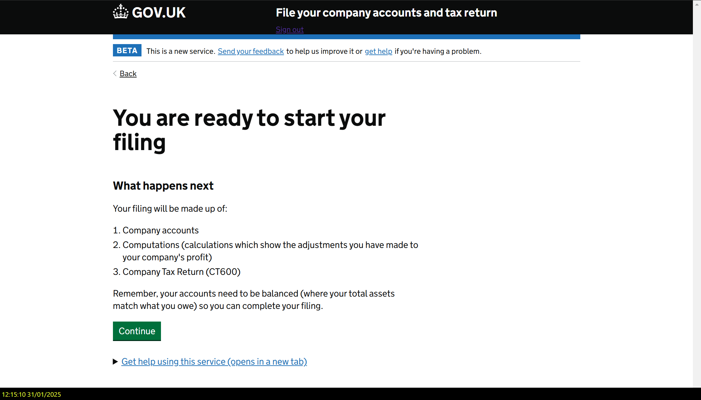

# UI Takeaways from HMRC Company Accounts Wizard

> **Context:** Screenshots captured from the GOV.UK "File your company accounts and tax return" service on 31 January 2025. This is a government-grade multi-step wizard for filing company accounts, computations, and Corporation Tax returns online.
>
> **Purpose:** Not to copy HMRC's design, but to identify proven UI patterns from a high-traffic, accessibility-compliant, government-tested wizard that could inform our Self-submission Audit Wizard.

---

## 1. Persistent Context Banner



Every step shows a **persistent identity bar** at the top of the content area:

```
Filing For: TUMAI FINANCE LONDON LTD | UTR: 8378326209
Period of accounts: 1 May 2023 to 30 April 2024
```

**Takeaway for our wizard:** Our audit wizard should display a persistent context strip showing the participant's name, their instrument type (Company / Manager / Engineer), the engagement name (e.g. "Nano Fibre UK"), and the submission status. This prevents disorientation — the user always knows *whose* submission they are working on and *which* audit they are completing.

**Proposed implementation:** A slim, sticky bar below the top navigation:

```
Participant: John Smith | Instrument: 02 Manager Audit | Engagement: Nano Fibre UK | Status: In Progress
```

---

## 2. Left-hand Section Navigation (Task List Pattern)



HMRC uses a **left sidebar with a vertical list of sections**, where:
- The current phase is **bold** (e.g. "Start computations")
- Completed phases show a **green checkmark** (e.g. "Company accounts" with a tick)
- Future phases are listed but not yet active (greyed out text)
- Sub-sections within the current phase are listed and clickable

**Takeaway for our wizard:** Our specification already defines a multi-section flow (Profile, Section 2, Section 3, ..., Review). A persistent left sidebar showing all sections — with completion status — would give participants a clear sense of progress and let them jump back to completed sections. This is superior to a simple linear progress bar because it names the sections explicitly.

**Proposed implementation:**
- Profile (Section 1) — completed (green tick)
- Section 2: Key Measures — completed (green tick)
- Section 3: Management Practices — **current** (bold, highlighted)
- Section 4: Employee Relations — not started (grey)
- Section 5: Department-specific — not started (grey)
- Review & Submit — locked until all sections complete

---

## 3. One Question per Page



HMRC follows the GDS (Government Digital Service) principle of **one thing per page** — each screen asks a single question or collects a single piece of information. Even when the question is trivially simple (e.g. "Does your company have any off balance sheet arrangements? Yes / No"), it gets its own full page.

**Takeaway for our wizard:** Our current specification groups questions into sections but does not prescribe how many questions appear per page. For simpler question types (SingleSelect, Yes/No radio, ConsentCheckbox), showing one question per page reduces cognitive load and makes auto-save trivial — each "Save and continue" click persists exactly one answer.

**Consideration:** Our audit instruments have many questions per section (some sections have 10+ questions). Showing one per page would make the wizard feel very long. **A hybrid approach is better:** group related questions into logical sub-steps (3-5 questions per page), but never overload a page. The HMRC balance sheet page (below) shows that even they allow multiple inputs on a single page when they form a logical unit.

---

## 4. "Save and Continue" as the Primary Action



Every page has a single **green "Save and continue" button** as the primary CTA. There is no "Next" without saving — the action explicitly tells the user their data is being saved. The only other navigation is the "Back" link at the top.

**Takeaway for our wizard:** Our specification mentions auto-save on every field change, which is excellent. But the primary button label should reinforce this: **"Save and continue"** rather than just "Next". This builds trust with participants who may be unfamiliar with web applications. If auto-save is already happening in the background, the button provides psychological reassurance.

**Also notable:** HMRC has no "Save as draft" button — saving is implicit in every forward action. Our wizard should work the same way.

---

## 5. Summary/Review Pages with Edit Links



After completing a group of questions, HMRC shows a **summary page** listing all sub-sections with their completion status and an "Edit" link for each. The pattern is:

```
▶ Directors report          ✓ Completed    Edit
▶ Dormancy statements       ✓ Completed    Edit
▶ Balance sheet             ✓ Completed    Edit
▶ Balance sheet statements  ✓ Completed    Edit
▶ Footnotes                 ✓ Completed    Edit
```

Clicking "Edit" takes the user back to that specific sub-section.

**Takeaway for our wizard:** Our "Review & Submit" step should follow this exact pattern. Before final submission, show a section-by-section summary where each section is expandable (the ▶ arrows are collapsible sections in HMRC) and each shows a status with an "Edit" link. This is far more useful than a flat list of all answers — it lets participants quickly scan for incomplete or incorrect sections.

**Also notable:** HMRC shows this summary at the **section level** (not individual questions). For our wizard, the review page should show section-level summaries by default, with expand/collapse to see individual answers within each section.

---

## 6. Answer Confirmation Pages



After answering a question, HMRC sometimes shows a **confirmation page** that displays the saved answer (e.g. "Directors' report prepared: No") with an "Edit" link, before the user proceeds. This is distinct from the final summary — it appears mid-flow.

**Takeaway for our wizard:** For critical branching questions (e.g. the Profile section where the user's department or job type determines their entire routing), showing a brief confirmation before proceeding would reduce errors. If someone selects "Stores/Materials" but meant "Civils", they see their choice reflected back before it routes them down a potentially long section path.

**Selective use only:** This pattern adds an extra click, so it should only be used for high-impact branching questions — not for every answer.

---

## 7. Structured Data Grids (TableGrid Pattern)



The balance sheet page shows a **structured grid** with:
- Row labels on the left (expandable with ▶)
- Two columns of numeric inputs (current period vs previous period)
- Field reference codes (AC460, AC450, etc.) above each input
- Auto-calculated totals in **bold** (e.g. "Net current assets" auto-sums)
- Currency prefix (£) on each row

**Takeaway for our wizard:** Our specification defines a `TableGrid` input type for rating scales and multi-criteria assessments. The HMRC approach shows how to make grids scannable: clear column headers with context (date ranges), row-level labels that can expand for detail, and automatic calculations for derived values. If our audit has sections where participants rate multiple criteria, this layout pattern — labels left, inputs right, reference codes visible — is proven to work.

**Additional idea:** The field reference codes (AC460, etc.) are useful for support. If a participant calls for help, they can say "I'm stuck on field AC460." Our wizard could show question reference numbers (e.g. "Q2.3" or "S3-Q5") for similar support scenarios.

---

## 8. Mandatory vs Optional Visual Distinction



The Footnotes page shows a checklist where items are explicitly labelled **(mandatory)** or **(optional)**. Mandatory items appear to have a slightly different visual treatment (the checkbox area has a different background shade).

**Takeaway for our wizard:** Our audit instruments have both required and optional questions. Each question card should clearly indicate whether a response is required. Rather than just an asterisk (*), using explicit labels like "(required)" or "(optional)" is more accessible and reduces ambiguity — particularly for participants who are not frequent web application users.

---

## 9. Contextual Help (Expandable)



Every page includes a persistent **"Get help using this service (opens in a new tab)"** link at the bottom, collapsed behind a ▶ disclosure triangle. Individual questions also have contextual help text (e.g. the AC8023 description explaining what a directors' report is).

**Takeaway for our wizard:** Each question should support optional helper text — a short description that explains what the question is asking and why. For the audit instruments, many questions use specialised terminology (e.g. "permit to work processes", "RAMS review cycle"). A short contextual description or tooltip would help participants answer accurately without leaving the wizard.

**Implementation options:**
- Inline grey hint text below the question (always visible)
- Expandable ▶ "What does this mean?" section per question
- A persistent "Help" link in the footer or sidebar

---

## 10. Phase Transition Screens


Before starting a new major phase, HMRC shows a **briefing screen** that explains:
- What the user is about to do ("Your filing will be made up of...")
- What they need to have ready
- Any prerequisites ("your accounts need to be balanced")

The screen at the end of "Company accounts" and before "Computations" follows the same pattern.

**Takeaway for our wizard:** Our wizard transitions between major sections (Profile → Section 2 → Section 3 → ... → Review). Each transition should include a brief **section introduction page** that:
1. Names the section and describes its purpose
2. Tells the participant how many questions to expect
3. Explains any special input types (e.g. "You will be asked to upload evidence documents in this section")

This reduces the "wall of questions" feeling and gives participants mental bookmarks.

---

## 11. "Track Your Submissions" Link


HMRC provides a persistent **"Track your submissions"** link in the header area, allowing users to view previously submitted filings alongside the current in-progress one.

**Takeaway for our wizard:** For the admin dashboard, and potentially for participants themselves, a "My Submissions" view that shows submission history — including past audits from previous periods — would be valuable. This is particularly relevant if the Limitless Modus engagement involves repeat audits (initial diagnostic → follow-up at 6 months).

---

## 12. Minimal Chrome, Maximum Content

Across all 12 screenshots, the HMRC wizard follows a consistent design philosophy:
- **No decorative elements** — no icons, illustrations, or colour blocks beyond the GOV.UK header
- **Large, clear headings** — each page title is unmistakable
- **Generous white space** — questions are not cramped
- **Limited navigation options** — only "Back" and "Save and continue" (no sidebar breadcrumbs on most pages)
- **No distracting progress bars** — the left sidebar *is* the progress indicator

**Takeaway for our wizard:** Resist the temptation to over-design the audit wizard. The participants are utility workers, managers, and engineers — they need to complete the audit efficiently, not admire the UI. A clean, spacious layout with large type, clear labels, and minimal distraction will outperform a visually rich but busy interface. Tailwind's utility-first approach and a disciplined component library align well with this philosophy.

---

## Summary Table: UI Ideas for Our Wizard

| # | Pattern | HMRC Example | Our Application | Priority |
|---|---------|-------------|-----------------|----------|
| 1 | Persistent context banner | Entity name, UTR, period | Participant, instrument, engagement, status | High |
| 2 | Section navigation sidebar | Left-hand task list with ticks | Section list with completion status | High |
| 3 | One question per page (or small groups) | Single question per screen | Hybrid: 3-5 related questions per page | Medium |
| 4 | "Save and continue" button label | Every page | Primary CTA label on every step | High |
| 5 | Summary/review with Edit links | Accounts summary page | Review & Submit step with per-section Edit | High |
| 6 | Answer confirmation for critical choices | Directors' report confirmation | Profile section branching questions only | Medium |
| 7 | Structured data grids | Balance sheet with reference codes | TableGrid and RatingScale inputs | Medium |
| 8 | Mandatory/optional labels | Footnotes with (mandatory)/(optional) | Per-question required/optional label | High |
| 9 | Contextual help | Expandable help text, AC reference descriptions | Per-question hint text or expandable help | Medium |
| 10 | Phase transition screens | "You're about to start..." intro pages | Section intro pages with question count | Medium |
| 11 | Submission history view | "Track your submissions" link | Admin dashboard + participant "My Submissions" | Low |
| 12 | Minimal chrome, maximum content | GDS design principles | Clean Tailwind layout, large type, white space | High |

---

*Note created 2 March 2026. Screenshots from GOV.UK Company Accounts filing service, captured 31 January 2025.*
*Source: `_inbox-raw/wizard-example-hmrc/` (12 screenshots)*
